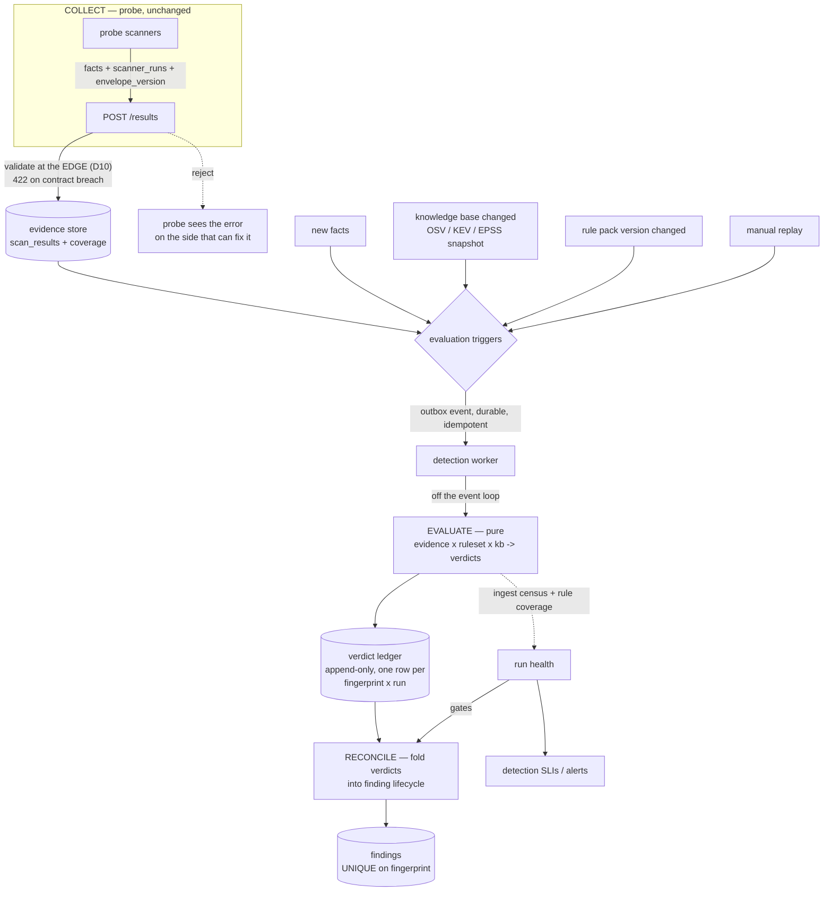

# ADR-0002: Detection architecture — separating collection from evaluation

**Status:** Proposed
**Date:** 2026-09-03
**Deciders:** Vedha platform owner
**Scope:** the whole path from a probe's fact to a finding's lifecycle state — the
detection subsystem as a system, not the individual rules
**Supersedes/extends:** [ADR-0001](0001-manager-detection-pipeline.md) (which fixed two
races on this path; this one is about the shape of the path itself)

## Context

ADR-0001 read the pipeline end to end and found four defects. Two were fixed (R1
advisory lock, R2 idempotency check). This ADR is a second pass at a higher altitude:
not "is this line correct" but "is this the right system".

The detection engine itself is good and this ADR does not propose changing it.
`posture_rules.py` is genuine detection-as-code — rules are data with id, severity, CWE,
ATT&CK technique, declared input paths, and known-FP notes. `matcher.py` enforces the
right anti-false-positive rule (a banner-derived version match can never be `confirmed`,
because distro backports make it unsound). The trust tier in `VALIDATED_SCANNERS` is the
posture analogue of the same rule. The detection trace makes a non-finding explain
itself. `test_fact_contract.py` is the highest-leverage test in the repo. That is a
stronger analytic core than most commercial scanners expose.

The problems are all in the layer around it — in how evidence reaches the engine, how
the engine's output is reconciled into a lifecycle, and in what triggers evaluation at
all. Sixteen are recorded below. Two of them can silently close a customer's real
findings, and one of those is currently masked by the other.

## Findings

Severity is customer impact, not code ugliness.

### D1 — The auto-resolution safety gate reads a different source of truth than detection

**Severity: blocker (silent false negative, destroys customer data).**

`resolution.py`'s stated safety rule is exactly right: *"absence of a finding is only
meaningful if we PROVED we looked."* The implementation proves it against the wrong
artifact.

Detection reads **ingested assets**:

```
facts → ingest._validate() → IngestResult.assets → every CVE and posture rule
```

Coverage reads **raw facts**, bypassing the ingester entirely
([resolution.py:36](../../manager/backend/app/detection/resolution.py)):

```python
assets = { host_of(f.get("target","")) for f in facts
           if f.get("scanner") in completed and host_of(f.get("target","")) }
```

`ingest._validate` requires `{scanner, target, timestamp, status}` and quarantines
anything else — silently, by design, so one corrupt line cannot sink a 100k-record pass.
So a probe-side rename of `timestamp` → `ts` produces:

| stage | result |
|---|---|
| ingest | every fact quarantined, 0 assets |
| CVE track | 0 findings (no assets to iterate) |
| posture track | 0 findings (same) |
| `build_coverage` | reads `f["target"]` and `f["scanner"]` off the **raw** dicts — reports every host as **provably re-observed by a completed scanner** |
| `evaluate_resolutions` | `covered=True`, `db_changed=False` → `miss_count += 1` on every open finding |
| after 1 run (low/med), 2 runs (crit/high) | `status = remediated`, `resolution_method = "auto"`, reason *"coverage-proven clean"* |

A one-line field rename in the probe therefore auto-closes the customer's entire live
risk set, stamped with a system attestation that we verified the fix. The ingest census
built precisely to make this visible (`_ingest_census`, `engine_bridge.py`) is computed,
logged, and stashed in `run.stats` — and then not consulted by the gate that needed it.

### D2 — Auto-resolution is inert in production, which is the only reason D1 has not fired

**Severity: blocker (feature does not work; and it is load-bearing for D1).**

`build_coverage(result.get("scanner_runs"), facts)` needs the probe's per-scanner run
trace. The probe does emit it ([probe/agent/engine.py:997](../../probe/agent/engine.py)).
It never arrives:

- `ScanResult` has no `scanner_runs` column — only `facts`
  ([scan_result.py:46](../../manager/backend/app/models/scan_result.py)).
- The outbox handler calls `create_findings_from_facts(db, ..., {"facts": sr.facts}, ...)`
  ([outbox.py:114](../../manager/backend/app/workers/outbox.py)) — a freshly built dict
  with one key.
- `/re-detect` passes `{"facts": ..., "scan_type": "re-detect"}` — same.

So `scanner_runs` is always `None`, coverage is always `{"assets": []}`, and
`decide_resolution` always returns `skip`. Findings accumulate forever and nothing
auto-closes. The `resolution_threshold` logic, the `db_changed` guard, the
`finding_events` audit trail — all unreachable on every production path.

**The two findings are coupled.** D2 is a fail-closed accident that masks D1. Plumbing
`scanner_runs` through — the obvious one-line fix for D2 — arms D1 in the same commit.
They must be fixed together, coverage first.

### D3 — Detection blocks the worker's event loop, and the consequences cascade

**Severity: high (throughput, and it manufactures the duplicates ADR-0001 fixed).**

`detect_all_from_facts_traced` is a synchronous function: it writes a temp file, parses
a 7.6 MB OSV snapshot and a 7.5 MB EPSS snapshot on first call, and runs pure-Python
version comparison across every candidate. It is called directly from `async def
create_findings_from_facts` with no `to_thread` and no executor. The codebase already
knows this is wrong — `app/auth/password.py` exists solely to push bcrypt off the loop,
with a docstring saying so.

The cascade, all inside one worker process:

```
detection blocks the loop
   ├─ the other 15 events in the asyncio.gather batch stall (head-of-line blocking)
   ├─ _write_heartbeat cannot run → campaign-progress reports the detection worker
   │   DOWN while it is in fact working → operator sees a false outage
   └─ _reclaim_stale cannot run in this worker; another worker's reclaimer sees
       locked_at older than the 5-minute lease → requeues the event → a second
       worker runs detection for a submission already in flight
```

The last branch is the important one: the blocking call *causes* the concurrent
detection that ADR-0001's advisory lock was added to survive.

### D4 — The two leases are inverted, so any run over 5 minutes is duplicated by design

**Severity: high (correctness).**

`PROCESSING_LEASE_SEC = 5 * 60` (event visibility) and `DETECTION_RUN_LEASE_SEC = 10 * 60`
(run liveness). The comment says the run lease is *"twice the event lease so a
legitimately-slow run is never killed"* — but that reasoning protects the wrong row. A
run legitimately taking 6 minutes has its **event** reclaimed at minute 5 while the run
is still healthy and holding the advisory lock. The band 5–10 minutes is not an edge
case; it is a guaranteed-duplicate window.

The invariant should be the reverse: **visibility timeout > p99.9 handler duration**, or
better, no fixed timeout at all. SQS solves this with `ChangeMessageVisibility` and
Temporal with activity heartbeats — the worker extends its own lease while it is
demonstrably alive, so slow work is never confused with dead work.

### D5 — The idempotency check is TOCTOU and has no constraint behind it

**Severity: high (correctness of campaign coverage).**

ADR-0001's R2 fix reads:

```python
already = SELECT DetectionRun.id WHERE scan_result_id = ... AND status = COMPLETED
if already is not None: return
n = await create_findings_from_facts(...)   # ← takes the advisory lock in here
```

The check runs **before** the lock, in a **different session**, against a peer's
**uncommitted** run. Under the exact concurrency it exists to prevent (D3/D4 produce it):
worker A is mid-run, uncommitted; worker B's SELECT sees nothing; B proceeds, blocks on
the advisory lock, A commits, B acquires the lock and runs the full detection again,
producing a second `COMPLETED` run for one `scan_result_id`. The guard holds for the
sequential retry case and fails for the concurrent one.

There is no unique index on `detection_runs(scan_result_id)` to catch it underneath.

### D6 — The advisory lock protects one of six Finding writers, over an unconstrained table

**Severity: high (duplicate findings, corrupted counts).**

`_lock_engagement_for_detection` is called from exactly one place. Findings are inserted
from at least six:

| writer | path | takes the lock |
|---|---|---|
| `engine_bridge` (CVE / posture / attack-path) | outbox worker | yes |
| `finding_translator.create_findings_from_probe_result` | synchronous submit request | no |
| `finding_translator.create_scan_health_finding` | synchronous submit request | no |
| `service_vuln.create_service_vuln_findings` | synchronous submit request | no |
| `vuln_scans` (nuclei) | FastAPI BackgroundTask | no |
| `ad.py`, `exploits.py` | request handlers | no |

The first three are worse than merely unlocked: `job_result_service` writes them and
enqueues `facts.ready` **in the same transaction**, so the submit path and the outbox
path are designed to run against the same engagement concurrently. Both do
`_find_open_duplicate` → insert, and there is **no unique index on `findings`** (verified
across all alembic revisions — every index on that table is non-unique).

`assets` has the same shape and is worse in consequence: `_resolve_asset` does
SELECT-then-INSERT with no unique constraint on `(engagement_id, ip_address)`. Two
duplicate Asset rows for one host permanently split that host's finding identity —
`_find_open_duplicate` keys on `asset_id`, so the same issue on the same host becomes two
findings that no future run can ever collapse.

ADR-0001 deferred the unique index as "defence in depth behind the lock." Given five
unlocked writers, it is not defence in depth; it is the only defence.

### D7 — Finding identity is a rendered presentation string

**Severity: high (fragile identity, history loss).**

The dedup key is `(engagement_id, asset_id, title)` where title is composed at write time:

```python
title = f"{cve} — {d.get('cpe','').split(':')[4] ...}"[:500]        # CVE track
base  = f"{rule.title} (port {port})"                              # posture track
```

Identity is therefore coupled to formatting. Editing a rule's `title`, changing the em
dash, or a CPE whose vendor field shifts position, re-keys every affected finding: the
next run sees no duplicate, inserts a new row, loses `first_seen`, resets the SLA clock,
and leaves the old row to be auto-resolved as "fixed". A cosmetic copy change becomes a
silent data migration across every tenant. The 500-char truncation adds a collision path
for long CPEs.

Every mature scanner separates identity from presentation: Tenable keys on
`(asset, plugin_id, port, protocol)`, Qualys on `(host, QID, port)`, SARIF carries an
explicit `fingerprints` field for exactly this reason. Vedha already computes stable ids
inside the engine — `make_finding_id(asset_ip, cve_id, cpe)` and posture's rule hash —
and then discards them at the persistence boundary in favour of the string.

### D8 — Detection only ever runs at scan time

**Severity: high (this is the competitive gap, not a bug).**

Evaluation is triggered by exactly one thing: fresh facts arriving. When CISA adds a KEV
entry tonight for a service scanned last week, nothing happens. The host stays "clean"
until someone re-scans the network.

`/re-detect` exists but is not a substitute:

- it runs on `BackgroundTasks` — in-process, non-durable, dropped on any restart. This is
  precisely the anti-pattern `outbox.py`'s own docstring says the outbox was built to
  replace;
- it loads **every fact of the entire engagement** into one Python list before dispatch;
- it passes no `scan_result_id`, so D5's idempotency guard does not apply to it at all;
- it is manual, unthrottled, and un-debounced — five clicks are five full runs, serialised
  on the advisory lock, each holding a transaction.

The industry has settled this. Dependabot re-evaluates stored dependency graphs when an
advisory is published rather than when code changes. Wiz and Orca evaluate rules against
a stored security graph, so a new rule or new CVE re-scores the estate without touching
the network. Tenable and Qualys ship plugin/KnowledgeBase feeds that re-evaluate existing
findings. **The common structure is that collection and evaluation are separate stages
with independent triggers.** Vedha has the durable evidence store (`scan_results`) and a
deterministic pinned-snapshot engine — the two hard prerequisites — and simply does not
have the second trigger.

### D9 — A run that understood nothing reports `COMPLETED`

**Severity: medium (indistinguishable failure states).**

`DetectionRun.status` is `running | completed | failed`. There is no degraded state. A run
where ingest quarantined 100% of facts writes `run.status = RUN_COMPLETED` with
`findings_new = 0`, and every consumer — campaign progress, the portal, the posture score
— reads that as a clean result. `_log_ingest_health` logs `detection_engine.all_facts_rejected`
with an excellent hint, into structlog, where no product surface reads it.

### D10 — The fact contract is enforced at detection time, not at the boundary

**Severity: medium.**

Facts are accepted by the API, persisted, acknowledged to the probe, and only validated
minutes later inside the worker — where rejection is silent by design. The probe gets a
`200` for a payload the system cannot use, so drift is invisible on the side that can fix
it. `ingest.py`'s own docstring flags the deeper version of this: it validates
scanner_module's `ScanResult` schema, and the probe's envelope shape *"would be a separate,
additive parser, not assumed here"* — two producers, one validator written for one of them.

There is also no version field on the fact envelope, so neither side can detect a
contract change other than by its symptoms.

### D11 — The vuln-DB version stamp is read separately from the DB actually used

**Severity: medium (corrupts the `db_changed` safety guard).**

`_vuln_db_meta()` calls `load_snapshot()` to read the hash for `DetectionRun.vuln_db_version`.
`run_full_detection` then calls `load_snapshot()` again to do the matching. The memoization
is keyed on `(path, mtime_ns, size)`, so an out-of-band `update_snapshot.py` landing between
the two calls means the run is *stamped* with basis A and *detected* against basis B.

That stamp is not decorative: `decide_resolution` uses `detected_db_version != run.vuln_db_version`
to refuse to auto-close a finding that vanished because the database changed rather than
because the host was patched. A wrong stamp inverts that guard in both directions.

### D12 — Every submission re-prioritises the whole engagement (ADR-0001 R3, still open)

**Severity: medium (scalability).**

Unchanged since ADR-0001, and now with a second call site: `job_result_service` also runs
`prioritize_engagement_findings` on the submit path as a fallback. A 10-probe campaign
does 20 full passes over a growing finding set, half of them inside the detection
transaction.

### D13 — There are no detection SLIs

**Severity: medium (operability).**

Everything above is observable only by reading structlog. There are no metrics for outbox
queue depth or age, dead-letter count, ingest quarantine rate, rules-blind count, run
duration, or detection lag. Consequently there is nothing to alert on, and **telemetry
health is not tracked separately from detection health** — the distinction that would have
made D1 and D9 loud instead of silent.

### D14 — The snapshot cache never evicts

**Severity: medium (memory).**

`_snapshot_cache: dict[(path, mtime_ns, size), VulnDB]` and the KEV/EPSS equivalents grow
without bound. Each weekly refresh adds a new entry and retains the old parsed database —
hundreds of MB of Python objects per generation in a long-lived worker. Correct as a
pinning mechanism, wrong as a cache: it needs to hold one generation, or be an explicit
`maxsize=2` LRU.

### D15 — Facts round-trip through a plaintext temp file

**Severity: low.**

`detect_all_from_facts_traced` serialises facts to `NamedTemporaryFile(delete=False)` so
the engine can re-parse them. Double the serialisation work, and customer scan data lands
unencrypted on the worker's local disk. The `finally: os.unlink` covers exceptions but not
SIGKILL/OOM, so crashes leave residue. The engine's own `ingest_files` is a thin wrapper
over a per-line loop; an `ingest_records(iterable_of_dicts)` entry point removes the file
entirely.

### D16 — The engine is reached by `sys.path` insertion (ADR-0001 R4, still open)

**Severity: low (deployability, with a real shadowing hazard).**

Unchanged, plus a detail ADR-0001 did not note: the inserted directory is placed at
`sys.path[0]` and exports top-level modules named `pipeline`, `models`, `ingest`,
`matcher`, `enrichment`. `models` in particular is a name a backend process can plausibly
import for something else. This is process-global mutation performed lazily from a
worker handler.

## Decision

Adopt a target architecture in which **collection and evaluation are separate stages with
independent triggers**, evaluation is a pure replayable function of
`(evidence × ruleset × knowledge base)`, and the finding lifecycle is a fold over an
append-only verdict ledger rather than a read-modify-write against the findings table.



Five structural commitments:

**1. Stable fingerprints, not titles (D7).** `findings` gains a `fingerprint` column —
`sha256(rule_id | cve_id, asset_key, port, proto)` — computed by the engine, which already
computes exactly this. `title` becomes pure presentation and can be edited freely. A
partial unique index on `(engagement_id, fingerprint) WHERE status IN (open, confirmed,
accepted)` makes duplicates impossible for **all six writers** (D6), not only the locked
one, and lets every writer use `ON CONFLICT DO UPDATE` instead of read-then-write.
`assets` gets `UNIQUE (engagement_id, ip_address)` for the same reason.

**2. One source of truth for coverage (D1).** `build_coverage` moves to consume the
engine's `IngestResult` — an asset is covered iff *the ingester produced it* **and** its
scanner run completed. Detection and resolution then answer "did we look at this host"
from the same artifact, and the drift case becomes structurally incapable of proving
coverage. `scanner_runs` is persisted alongside the facts (D2) so the input exists at all;
that change and this one land together.

**3. Run health is a first-class state that gates writes (D9, D1).** `DetectionRun.status`
gains `completed_degraded`. A run is degraded when the ingest census shows material
quarantine, when a rule the engine expected to evaluate came back blind, or when scanner
runs are missing. **A degraded run may create and reaffirm findings but may never
auto-resolve one** — the gate reads run health, not just coverage. This is the same
principle as Chronicle's and Panther's separation of log-source health from detection
health, and it is the one control that makes D1's class of failure fail closed forever.

**4. Evaluation is triggered by knowledge, not only by scans (D8).** `update_snapshot.py`
finishing emits a `knowledge.updated` outbox event carrying the new content hash. A fan-out
handler enqueues one durable `evaluate` event per `(engagement, scan_result)` whose stamped
`vuln_db_version` differs, subject to a per-tenant rate budget. The same worker, the same
idempotency key, the same ledger — replay is not a special path, it is the normal path with
a different trigger. `/re-detect` becomes a thin producer of those same events instead of a
non-durable `BackgroundTask`. This is the Dependabot/Wiz model, and it is what turns a
point-in-time scanner into continuous vulnerability management.

**5. Idempotency by key, not by lookup (D5).** A detection run is identified by
`(scan_result_id, ruleset_version, kb_version)` with a unique index. Re-evaluating the same
evidence against the same rules and the same knowledge base is a no-op enforced by the
database; re-evaluating it against a *new* knowledge base is a legitimately distinct run
and is allowed. The TOCTOU SELECT is deleted rather than moved.

Alongside these, evaluation moves off the event loop (D3) and the fixed visibility timeout
is replaced by lease heartbeating (D4) — the worker extends `locked_at` on a timer while
the handler runs, so a slow run is never mistaken for a dead one.

### On the detection core itself

The core is sound and this ADR keeps it. Two additions are worth making once the plumbing
above is in place, both extensions of rules the engine already follows:

**Corroboration as a first-class channel.** The engine already ceilings state by evidence
tier (`authoritative` → may be `confirmed`; inferred → `suspected` at best). What it does
not do is record *independent agreement*. Two independent tiers observing the same weakness
is materially stronger evidence than one, and a contradiction between them is a signal in
its own right — the exact "prefer multiple weak signals combined" discipline the CVE track
already applies via `correlate_smb_patch`. The verdict ledger makes this cheap: corroboration
becomes a fold over the ledger rows for one fingerprint rather than new state on the finding.

**Rule coverage as a time series.** Per-run verdicts already record drift / clean /
no-evidence. The missing dimension is time: a rule that has been `missing_input` for three
weeks is an outage in the detection surface, and today nothing notices. Persisting per-rule
verdicts as a series turns `test_fact_contract.py`'s guarantee — which holds only against a
captured corpus at CI time — into a continuous production one, and gives the ATT&CK/CWE
coverage view that buyers ask for.

## Alternatives considered

**Keep the read-modify-write lifecycle and only add the unique index.** Simpler, and it does
fix D6/D7. It does not fix D1 or D8, and it leaves the lifecycle logic spread across six
writers that each have to get reaffirm/reopen/resolve right. The ledger centralises that
into one fold. Rejected as insufficient, but the index is the first thing to ship from this
ADR regardless — it is valuable on its own.

**Move detection to a separate service with its own queue (Kafka/Redis Streams).** Justified
eventually; not now. The outbox on Postgres is the right choice at this volume and
`outbox.py`'s docstring already reasons about when to revisit. The trigger to revisit is
queue lag exceeding budget (D13 gives us the metric), not architectural preference.

**Process pool instead of a thread for the engine.** The heavy work is pure-Python dict and
string comparison and therefore GIL-bound, so a thread pool unblocks the event loop (the
actual bug) without giving CPU parallelism, while a process pool gives parallelism at the
cost of one ~200 MB snapshot cache per process. Start with `to_thread` because it fixes the
cascade in D3 for one line of change; move to a process pool or a dedicated service only
when measured run duration says so.

## Consequences

**Easier:** finding identity survives copy edits; duplicates become impossible rather than
merely unlikely; a fact-shape drift fails closed and loudly instead of quietly closing the
customer's findings; new KEV entries surface without a re-scan; a slow run stops
manufacturing its own duplicates; every failure above becomes an alertable metric.

**Harder:** a `fingerprint` backfill and duplicate reconciliation are required before the
unique index can be created, and that migration must run against existing tenant data.
The verdict ledger adds a table that grows per run per fingerprint and needs a retention
policy. Knowledge-triggered fan-out adds a load pattern the system has never seen — it must
ship behind a per-tenant rate budget and a kill switch.

**To revisit:** if knowledge-triggered replay dominates the queue, evaluation is a candidate
to split into its own service with its own scaling policy. D13's metrics are the input to
that decision.

## Action items

Ordered by "what fails worst", not by effort.

**Phase 0 — stop the bleeding (days)**

1. [ ] **D1+D2 together.** Persist `scanner_runs` on `ScanResult`; rebuild `build_coverage`
       on `IngestResult.assets`; refuse auto-resolution on any run whose ingest census shows
       material loss. Regression test: a corpus with a renamed required field must produce
       zero resolutions and a degraded run.
2. [ ] **D3.** Wrap `detect_all_from_facts_traced` in `asyncio.to_thread`.
3. [ ] **D4.** Raise the event lease above the measured p99.9 run duration as an immediate
       stopgap; lease heartbeating in Phase 1.
4. [ ] **D9.** Add `completed_degraded` to `DetectionRun.status`; surface it in campaign
       progress and the portal.

**Phase 1 — identity and idempotency (1–2 weeks)**

5. [ ] **D7+D6.** Add `findings.fingerprint`, backfill, reconcile duplicates, then the
       partial unique index; `UNIQUE (engagement_id, ip_address)` on `assets`; convert all
       six writers to `ON CONFLICT`.
6. [ ] **D5.** Unique index on `(scan_result_id, ruleset_version, kb_version)`; delete the
       pre-lock SELECT.
7. [ ] **D11.** Load the snapshot once per run and pass the `VulnDB` into the engine, so the
       stamp and the matching provably share one object.
8. [ ] **D10.** Validate the fact envelope at the API edge; add `envelope_version`; return
       422 on contract breach.
9. [ ] **D13.** Metrics: queue depth and age, DLQ count, quarantine rate, blind-rule count,
       run duration, detection lag. Alert on DLQ > 0 and on any degraded run.

**Phase 2 — continuous evaluation (the competitive piece)**

10. [ ] **D8.** `knowledge.updated` event → rate-budgeted per-engagement replay fan-out;
        re-point `/re-detect` at it; retire the `BackgroundTask`.
11. [ ] Verdict ledger + reconcile fold.

**Phase 3 — detection quality**

12. [ ] **D12** (ADR-0001 R3), **D14**, **D15**, **D16** — the deferred hygiene items.
13. [ ] Corroboration channel over the ledger; per-rule coverage time series with alerting
        on a rule blind for N runs.
