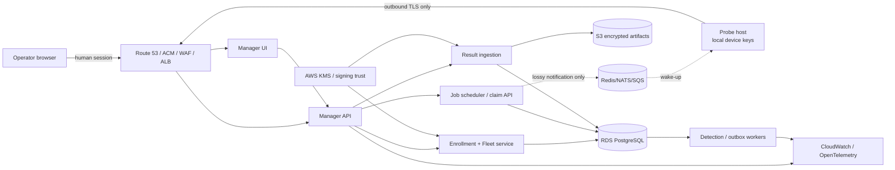

# Vedha production improvement review

**Status:** Proposed architecture and release-gate review

**Reviewed:** 2026-08-03

**Baseline:** commit `65f22a7e7696` plus the current uncommitted workspace

**Scope:** Probe installation and runtime, Manager API/UI, job and result lifecycle, security boundaries, release engineering, and AWS deployment

**Intent:** Design and prioritization only. This file does not implement or authorize deployment changes.

> Security note: this review names files containing credential material but deliberately does not reproduce any value.

## Executive verdict

Vedha has promising building blocks, but the current workspace is **not ready for a production AWS deployment or broad probe rollout**. The main gaps are security-boundary failures and lifecycle correctness, not UI polish:

1. Tracked credentials/private keys require an incident response before another release.
2. A one-year probe JWT is accepted as a general tenant access token, so a compromised probe can reach human-facing data and paid AI endpoints.
3. The shared bootstrap path is unreachable as written and would be cross-tenant unsafe if simply exposed.
4. The probe can crash on a manager outage or reuse stale jobs; leases have no execution-attempt fencing.
5. The AWS installer can fail the production API at startup, is not safely rerunnable, can regress preserved secrets, and cannot actually roll back.
6. The current “single-command” installer still requires a PAT, local CIDRs, licensing data, and other manual inputs.

The requested product experience is achievable with this contract:

```text
One command + one manager endpoint
→ locally generated device identity
→ pending request in Manager Fleet UI
→ operator approves a Site policy
→ manager issues device-bound workload credentials
→ probe becomes ready
→ manager creates and assigns every job ID
```

The manager endpoint is discovery information, **not an authentication secret**. A probe must never receive a human PAT, admin password, vendor signing private key, or installation-time job ID.

## Release decision

**Decision: NO-GO for production AWS and unmanaged fleet rollout until Gate 0 is complete.**

Severity in this review means:

- **P0 / blocker:** resolve before any AWS redeploy, customer pilot, or bootstrap enablement.
- **P1 / high:** resolve before the one-command enrollment feature is called production-ready.
- **P2 / scale:** resolve before multi-AZ, multi-replica, or large-fleet claims.
- **P3 / quality:** improve maintainability, usability, and operating cost after correctness gates pass.

## Implementation status checklist (verified 2026-08-03 against HEAD `f1da96f`)

> This section was added after re-verifying the review against the **current** workspace. The review baseline was `65f22a7`; substantial remediation has landed since, so several blockers are now closed in code. Each item below was checked by reading the referenced source at HEAD, not the baseline. Line numbers have shifted from the original review.
>
> Legend: ✅ done/verified · 🟡 partial (containment or schema landed, hardening remains) · ❌ still open · ⬜ not independently re-verified this pass.

### Gate 0 blockers

| ID | Status | What I verified at HEAD | Remaining work |
|---|---|---|---|
| SEC-01 | 🟡 **Repo hygiene done — rotation/history purge still required** | **Done this pass:** untracked `probe/probe.env`, `probe/.lab-run/` (state + spool), `manager/frontend/data/probe-keys.json`, `manager/frontend/data/probe-state.json` via `git rm --cached` (working copies preserved); untracked all 52 tracked `.pyc`/`.DS_Store` noise files; hardened `.gitignore` to cover them; added Gitleaks + `detect-private-key` in `.pre-commit-config.yaml` and a `.github/workflows/secret-scan.yml` CI gate (full-history scan). | **Human-only, not done:** rotate/revoke the exposed `PROBE_PAT`, device JWT, and any signing keys; purge the values from Git **history** (`git-filter-repo`/BFG) since untracking does not remove them from past commits; coordinate fresh clones. These require credential access and a shared-history rewrite decision. |
| SEC-02 | 🟡 **Largely done** | `create_device_access_token` issues `aud=vedha-probe-api`, `typ=device_access`, `credential_generation`, 10-min expiry (`auth/jwt.py:40-57`). Middleware enforces a least-privilege agent route allowlist (`agent_jwt_path_allows`) and DB-backed device checks: rejects non-`active` lifecycle, stale `credential_generation`, wrong `aud` (`auth/middleware.py:37-163`). | JWT still lacks `iss` and `kid` (`jwt.py` has no issuer/key-id); legacy `register`/`bootstrap` still mint **1-year** bearer JWTs (`routers/agents.py:568-572,628-632`). Route allowlist contains blast radius but the year-long bearer is not yet retired. |
| ENR-01 | ✅ **Contained (disabled)** | `/agents/bootstrap` now hard-fails unless `allow_unsafe_legacy_probe_bootstrap` is set (`routers/agents.py:499-506`), uses `secrets.compare_digest`. Disabled by default per the review's directive. | Remove entirely after migration (still present in code; "resolve first active tenant" logic remains). |
| PROBE-01 | ✅ **Fixed** | Poll loop initializes `jobs: list[dict] = []` every iteration (`probe/agent/agent.py:288`), `_poll_jobs_or_empty` returns `[]` on transient failure (`:80-88`), and the generic except path `continue`s (`:317-319`). | Add the first-outage/stale-list regression tests the review asks for. |
| JOB-01 | ✅ **Fenced** | `scan_job_attempt` table/model exists (migration `0017_scan_job_attempts`), reaper expires fenced attempts and enforces `attempt_count >= max_attempts` with `current_attempt_id` (`workers/reaper.py:33-79`). | Verify probe-side stop-after-grace still needed (see Probe lifecycle #9); confirm monotonic fence on every attempt message. |
| SCOPE-01 | ✅ **Fail-closed** | `_job_reachability_scope` returns `None` (deny) for empty/NULL authoritative scope and never treats empty as unrestricted (`routers/agents.py:149-153`); dispatch denies on `None` (`:220-223`). | Confirm the same fail-closed rule at result-ingestion revalidation. |
| DEPLOY-01 | ✅ **Fixed** | `AUTH_COOKIE_SECURE` is now passed to backend env (`manager/docker-compose.yml:35,281`). | Add the production Compose boot test to keep it from regressing. |
| DEPLOY-02 | ✅ **Idempotent** | Secrets are preserved across reruns (JWT/signing-seed/admin — `install.sh:325-339`); env is rendered via `mktemp` + unique installer block markers `# >>> vedha-aws-installer >>>` stripped/rewritten with `sed` (`:513-520`), removing the duplicate-append bug. Install lock + port/arch/disk preflight with `die` (`:86-137`). | Test fresh→rerun with and without SSM as an automated gate. |
| DEPLOY-03 | ✅ **Rollback exists** | Retained immutable release pointer + `rollback_previous_release()` invoked on failed deploy (`install.sh:585-638`). | Confirm expand/contract migration reversibility; retain N prior digests. |
| DEPLOY-04 | ✅ **Gating fatal** | `verify.sh` accepts both `--full` and `--mode full` and validates mode (`verify.sh:36-45`); docs use `--mode full` (`aws-deployment.md:362`). Installer now **fails** on verify error via `die`, and `SKIP_VERIFY` requires explicit `ALLOW_SKIP_VERIFY` (`install.sh:624-635`). | Ensure verify exercises public TLS + one no-op end-to-end job. |

**Gate 0 summary: 8 of 9 blockers closed or contained in code; SEC-01 (tracked secrets) is the one hard blocker still open, and SEC-02 has a residual 1-year legacy bearer to retire.**

### Gate 1 — enrollment foundation (substantially landed)

- ✅ New models/migrations present: `probe_site`, `probe_enrollment`, `scan_job_attempt`, `scan_result`, `outbox`, `audit_log` (migration `0018_probe_enrollment`).
- ✅ Agent lifecycle fields added: `site_id`, `lifecycle_status`, `signing_key_fingerprint`, `credential_generation` (`models/agent.py:40-46`).
- ✅ Public enrollment namespace with rate-limited paths and **real Ed25519 proof-of-possession**: `_verify_signature` verifies device signatures, secrets stored only as SHA-256/keyed hashes, nonce/challenge flow (`routers/probe_enrollment.py`).
- ✅ Device credentials are DB-checked on every request and short-lived (10 min).
- 🟡 Read-only Fleet UI / approval workflow — **not re-verified this pass** (backend contract exists; frontend Fleet pages unconfirmed).

### Detailed findings — spot-verified

- ✅ Async #14 (unbounded gzip): request body decode now capped at 128 MB decompressed and rejects malformed gzip (`main.py:103-145`).
- ✅ Scope/jobs #8 (attempt model): `scan_job_attempt` with fence + `max_attempts` implemented.
- ✅ Scope/jobs #1 (manager-generated job IDs): confirmed still server-generated.
- ✅ Probe lifecycle #10 (spool growth): probe now gates new jobs on `spool.at_capacity` with high-water warning (`probe/agent/agent.py:295-302`).
- ✅ Async #12 (outbox stale-lock): **fixed this pass.** Added `is_stale_processing()` + `_reclaim_stale()` to `workers/outbox.py`, swept every `RECLAIM_INTERVAL_SEC` inside `run_worker`: events a crashed worker left in `PROCESSING` past a 5-min lease are requeued (or dead-lettered once `attempts >= max_attempts`), so no acknowledged-durable event is silently stranded. Uses the existing `locked_at` column (no migration). Covered by `tests/test_outbox_reclaim.py` (12 tests: staleness predicate, cutoff, both SQL sweeps compiled against the Postgres dialect, and async orchestration with a mocked session — all passing; full manager suite **404 passed / 3 skipped**, no regression). Handlers remain required to be idempotent (the normal retry path already re-runs them).
- 🟡 Scope/jobs #6 (result column conflation): separate `scan_result` table added, but `scan_jobs.result` JSONB column still exists (`models/scan_job.py:30`) — lineage split incomplete.
- ✅ Manager identity #2 (agent lifecycle control): lifecycle/generation/fingerprint/site fields added.
- ✅ Audit events: `audit_log` model is written from `probe_enrollment`, `exploits`, `activity` routers (partial coverage; not yet every event class the review lists).
- ❌ Manager #10 (frontend sources of truth): file-backed stores still present (`lib/agents-store.ts`, `lib/job-store.ts`, `data/*.json`) and some are the SEC-01 tracked secrets.

### Not re-verified this pass (still assume open per original review)

⬜ Most of the Detailed-findings items under *Manager identity/tenancy* (RLS, login ambiguity, PAT scopes), the full *AWS & release operations* list (IaC, multi-AZ, health split, proxy trust, cost controls), the release pipeline at repo root, HTTP/WSS trust parity, and the entire *edge-case contract* test matrix were **not** individually re-checked at HEAD. Treat them as open unless separately verified. Gates 2–5 (artifact/lifecycle, job/result reliability at scale, AWS production platform, fleet scale) remain future work.

### Net assessment

The **NO-GO** verdict still stands, but the reason has narrowed further after this pass. The dangerous auth-boundary and lifecycle-correctness blockers (SEC-02, PROBE-01, JOB-01, SCOPE-01, and all four DEPLOY items) are substantially fixed in code, and this pass closed the SEC-01 repo-hygiene work and the outbox stale-lock stranding (async #12).

**What remains before the pilot tier is releasable:**

1. **SEC-01 operational tail (human-only):** rotate the exposed `PROBE_PAT`/device JWT/signing keys and purge them from Git *history*. Untracking (done) stops future leakage; it does not scrub past commits.
2. **Retire the legacy 1-year probe bearer JWT** (`routers/agents.py:568,628`). Deliberately **not changed here** — shortening or removing it is an outward-facing change that can lock out field probes still on the legacy path, so it needs a migration window / feature-flag decision, not a unilateral edit.
3. **Remove the frontend file stores from production builds** (`lib/agents-store.ts`, `lib/job-store.ts`, `data/*.json`). Larger refactor: some `data/*.json` (e.g. `findings.json`) is demo seed data the app reads, so it needs isolation behind a demo flag rather than deletion.

Gates 2–5 (artifact/lifecycle, job/result reliability at scale, IaC-managed multi-AZ AWS, fleet scale) remain future work.

## Foundations worth preserving

The redesign should build on the parts that already have the right shape:

- Probe runtime hardening already uses a non-root UID, read-only root filesystem, dropped capabilities, `no-new-privileges`, PID limit, tmpfs, and init (`probe/install.sh:365-378`; `scripts/lib/probe.sh:184-215`).
- Probe state writes are atomic and private with `0700` directories and `0600` files (`probe/agent/transport.py:44-73`).
- The probe checks Manager engagement scope, exclusions, and a separate local network ceiling before scanning (`probe/agent/task_runner.py:212-325`). This two-boundary design is valuable.
- HTTP job claiming uses tenant, capability, reachability, and a conditional update (`manager/backend/app/routers/agents.py:716-804`).
- Terminal result retries are treated idempotently (`manager/backend/app/services/job_result_service.py:47-62`).
- Raw facts plus a transactional outbox are better foundations than fire-and-forget background tasks (`manager/backend/app/services/job_result_service.py:71-123`).
- The production Compose file does not publish Postgres or Redis to the host, and API/frontend ports are loopback-bound (`manager/docker-compose.yml:63-88,166-169,256-258`).

These are useful primitives, not evidence that the complete system is production-ready.

## Gate 0: immediate blockers

| ID | Finding | Evidence | Impact | Required release gate |
|---|---|---|---|---|
| SEC-01 | Live-looking PAT/JWT/private identity material is tracked in Git. | `probe/probe.env:10`, `probe/.lab-run/state.json:1`, `manager/frontend/data/probe-keys.json:2,4`, `manager/frontend/data/probe-state.json`; ignore gaps in `.gitignore:7-15,41-51` | Repository access can become probe/tenant access; history and clones retain deleted values. | Revoke/rotate every affected credential and key, invalidate derived agent sessions, inventory clones/artifacts, purge history if it left the machine, force coordinated fresh clones, and add secret scanning in pre-commit and CI. |
| SEC-02 | Probe and human authentication share one authorization boundary. | Probe gets a one-year access JWT (`agents.py:542-547,600-607`); JWT lacks `iss`, `aud`, workload scopes, client type, and `kid` (`auth/jwt.py:20-55`); middleware accepts it as generic `AuthUser` (`auth/middleware.py:66-82`). | A stolen probe token can read tenant engagements/findings/analytics and call AI generation (`routers/engagements.py:370-380`, `routers/findings.py:67-89`, `routers/ai.py:18-22`). | Create a workload-only audience and endpoint namespace; reject device credentials everywhere else; add database-backed status/revocation. |
| ENR-01 | Shared bootstrap is both nonfunctional and unsafe. | `/agents/bootstrap` is not public (`auth/middleware.py:15-35`) while the probe calls it without bearer auth; it uses one global key, chooses the first active tenant, deduplicates by name, and issues a one-year JWT (`agents.py:466-550`). | Enabling it by adding a public-path exception creates replay and cross-tenant risk. | Keep it disabled and remove it after migration. Do not repair it as the production enrollment mechanism. |
| PROBE-01 | A manager outage can crash the probe or repeat stale jobs. | `jobs` is assigned inside the poll `try`, but the generic exception path neither initializes it nor continues (`probe/agent/agent.py:234-258`). | First failure can raise an unbound-local error; later failures can reuse the prior list and repeat work. | Initialize `jobs = []` on every iteration, continue after poll failure, and add first-outage/stale-list regression tests. |
| JOB-01 | Lease expiry can produce two active scans with no fencing. | Reaper clears and requeues by job/agent/expiry only (`workers/reaper.py:31-50`); a probe continues after a failed lease heartbeat (`probe/agent/agent.py:294-319`). | Old and new probes can scan the same target concurrently; a stale result can win. This is dangerous for OT/aggressive jobs. | Add immutable execution attempts and monotonic fencing generations. Only the current attempt may heartbeat or complete; stop/quarantine work after bounded lease loss. |
| SCOPE-01 | Empty authoritative engagement scope can fail open during dispatch. | Reachability rejects outside networks only when `allowed` is non-empty (`manager/backend/app/routers/agents.py:192-200`). | A job with targets but no approved scope may be dispatched. | Empty/missing authoritative scope must deny dispatch. Require a policy snapshot for every executable job. |
| DEPLOY-01 | The AWS production API can fail startup because a required secure-cookie setting is not passed to backend services. | Compose backend env omits `AUTH_COOKIE_SECURE` (`manager/docker-compose.yml:28-53,152-153`); production startup marks the false/missing setting fatal (`manager/backend/app/auth/startup.py:222-230,283-290,330-335`; `main.py:62-75`). | A nominally successful infrastructure launch can terminate FastAPI. | Fix setting ownership and add a production Compose boot test before deploying. If it is only a browser/BFF invariant, validate it in the frontend rather than FastAPI. |
| DEPLOY-02 | AWS installation is not idempotent and may regress secrets on rerun. | Port preflight rejects the installer’s own existing Caddy (`deploy/aws/install.sh:110-116,400-411`). The installer copies an example env, appends duplicate managed keys, then reads the first duplicate on rerun (`:255-275,441-469`). | The documented redeploy can fail before update or change the effective DB/JWT/admin values and take the database offline. | Render one canonical config with unique keys; distinguish the existing Vedha stack from foreign listeners; test fresh install → identical rerun with and without SSM. |
| DEPLOY-03 | Deployment rollback is only a restart of the overwritten image tag. | Build overwrites `vedha-backend:local` (`manager/docker-compose.yml:15-25`; `deploy/aws/install.sh:480-493`); failure runs `up --no-build` after migrations (`:509-517`). | The previous artifact is gone and the schema is not reversed. | Build immutable digests, retain prior releases, use expand/contract migrations, and gate rollback compatibility. |
| DEPLOY-04 | Verification cannot gate a release. | Docs call unsupported `--full`; script accepts `--mode full` (`docs/deployment/aws-deployment.md:358-367`; `deploy/aws/verify.sh:27-35`). Installer converts smoke failure to a warning and prints success (`deploy/aws/install.sh:521-540`). | Broken public TLS/UI/worker/job flows can be declared successfully deployed. | Make verification contract-correct and fatal; exercise the public endpoint and one no-op end-to-end job. |

### Required incident response for SEC-01

This is an operational action, not a normal cleanup commit:

1. Revoke the tracked PAT and device JWT; quarantine the associated probe identities.
2. Rotate the tracked signing/encryption keypairs and any certificates or artifacts derived from them.
3. Search Git history, forks, CI artifacts, container layers, backups, chat, shell history, and developer clones for exposure.
4. Remove runtime state from the index and purge Git history with a coordinated `git-filter-repo`/BFG procedure if the repository was shared.
5. Rotate again after the history rewrite if any credential was used during cleanup.
6. Add ignore rules for `probe.env`, `.lab-run/`, generated certificates/keys, frontend runtime-state files, `.pyc`, `.DS_Store`, local scan output, and binaries.
7. Run Gitleaks or an equivalent scanner in pre-commit and CI; block pushes on verified secrets.

Do not place any discovered secret value in tickets, logs, or this document.

## Detailed findings

### Probe installation and lifecycle

1. **The advertised one-line installer is still multi-input.** It prompts for Manager URL, PAT, name, location, local network segments, license, and public key (`probe/install.sh:180-199`). The noninteractive example also needs all of these (`:4-19`).
2. **Two bootstrap systems have drifted.** `probe/install.sh`, `scripts/run-probe.sh`, the root README, `probe/HOW_TO_RUN.md`, and `scripts/README-probe-bootstrap.md` describe different requirements and flows. The product needs one supported installer contract and one implementation library.
3. **The installer trusts mutable artifacts.** Image tar/registry download has no digest/signature verification (`probe/install.sh:60-97`); the image defaults to a mutable tag; `probe/Dockerfile:5` uses an unpinned base; runtime packages use lower bounds without hashes (`requirements-runtime.txt:5-7`).
4. **The fixed temporary image filename is collision-prone.** Concurrent installers share `${TMPDIR}/vedha-probe-image.tar` (`probe/install.sh:60-74`). Use a private `mktemp -d`, lock the installation, and clean with traps.
5. **No graceful drain exists.** Installation/recreation force-removes the container (`probe/install.sh:431-453`; `scripts/lib/probe.sh:218-245`), which can interrupt a scan. Upgrade and uninstall do not coordinate manager state or credential revocation.
6. **Agent state is protected by file permissions but remains a reusable long-lived bearer plus private X25519 key** (`transport.py:168-208`; `agent.py:715-756`). File permissions are necessary, not a revocation or proof-of-possession model.
7. **mTLS/private-CA settings cover HTTP but not the WebSocket path.** HTTP config accepts CA/client certs (`transport.py:118-135`), while WebSocket creation does not carry the equivalent SSL context (`:487-514`).
8. **Transport errors are not typed consistently.** Heartbeat maps only `401` specially and collapses other HTTP errors to `False`; polling maps only `401` to re-registration (`transport.py:348-387`). Revoked, quarantined, incompatible, overloaded, and transient conditions need distinct behavior.
9. **Lease loss does not stop active work.** The probe logs that it will preserve the result and continues scanning (`agent.py:294-319`). Fencing protects the server, but the probe must also stop network activity after a policy-specific grace period.
10. **Result spool growth is unbounded.** It has good atomic writes but no maximum bytes/files/age, disk-pressure control, corrupt-file quarantine, or permanent-error dead letter (`result_spool.py:59-183`). Permanent `413/422` results are retried forever (`transport.py:410-457`).
11. **`current_job_id` is not reliably cleared.** Manager HTTP/WS code updates it only when a value is truthy, while the probe sends `None` after completion (`agents.py:657-680`; `agent_ws.py:218-249`; `probe/agent/agent.py:538-544`).
12. **There is no release pipeline.** The apparent workflow is below `manager/frontend/.github/workflows`, so GitHub does not discover it at repository root; it calls missing `build/build_probe.py` and leaves tools/signing as placeholders (`build-probe.yml:44-95`). AWS sparse checkout excludes `probe/`, and Caddy exposes no signed artifact manifest.

### Manager identity, tenancy, and policy

1. **Agent identity is mutable display name.** Registration/bootstrap reuse `(tenant, name)` and may replace the public key, networks, and capabilities (`agents.py:508-525,564-607`). Duplicate hostnames, cloned VMs, or a malicious register call can reclaim an identity.
2. **The Agent model lacks lifecycle control.** There is no disabled/revoked/quarantined state, credential generation, device fingerprint, Site, installed version, desired version, or protocol compatibility (`models/agent.py:18-39`).
3. **Agents self-authorize routing data.** Refresh overwrites capabilities, network segments, and public key from the probe (`agents.py:683-713`). A workload must report observations but cannot expand approved policy.
4. **PAT automation is the wrong abstraction.** Default probe PAT scopes include engagement write (`auth/pat.py:12-29`), and registration converts a human/automation credential into an unrevocable year-long JWT. PATs should remain user/external-automation credentials.
5. **JWTs have no workload audience and no asymmetric key rotation.** Add `iss`, exact `aud`, `typ`, scopes, `kid`, short expiry, and database-backed credential generation/status. Prefer proof-of-possession or mTLS over bearer-only use.
6. **PAT authentication does not recheck tenant/user active state on each use.** Workload access must fail immediately for disabled tenants and revoked/quarantined probes.
7. **Login identity is ambiguous across tenants.** User uniqueness is `(tenant_id, email)`, but the login request has only email/password and lookup is not tenant-qualified (`models/user.py:15-23`; `auth/router.py`). Decide on globally unique login email, tenant slug, or an identity-provider subject.
8. **Tenant isolation is application-predicate only.** Keep code predicates, but add PostgreSQL RLS for high-value multi-tenant tables as a second boundary and tests that fail if tenant context is missing.
9. **Audit coverage is incomplete.** Enrollment, approval, denial, Site-policy change, credential issuance/rotation/revocation, quarantine, job state, result rejection, upgrade, and decommission must be immutable audit events.
10. **Frontend has multiple sources of truth.** File-backed/demo agent and job stores plus tracked runtime data diverge from the FastAPI/Postgres authority (`manager/frontend/lib/agents-store.ts`, `lib/job-store.ts`, `data/*`). Remove or strictly isolate demo data from production builds.
11. **No Fleet management workflow exists.** Current settings directs users toward manual PAT creation (`manager/frontend/app/settings/page.tsx:162-188`); there is no pending approval, Site policy, revoke/drain, credential rotation, version rollout, or diagnostics UI.

### Scope, jobs, results, and asynchronous work

1. **Keep manager-generated job IDs.** This already exists: UI enqueues `/agents/jobs` and receives a server-generated ID (`frontend/app/api/scan/launch/route.ts:89-108`; `models/scan_job.py:15-17`). Job IDs must never be installation inputs.
2. **Separate placement from work.** A probe belongs to a Tenant and a stable Site/deployment group. An Engagement is temporary work assigned through policy. Binding installation directly to one Engagement makes re-use and revocation brittle.
3. **Separate approved and observed network data.** Use `effective_networks = manager_approved_site_networks ∩ agent_reported_reachable_networks`; a report can shrink eligibility but never expand authorization.
4. **Preserve the local execution ceiling.** Moving configuration into the UI must not remove the probe-side enforcement. The Site policy should be signed, versioned, persisted locally, and enforced even when the Manager is temporarily unavailable.
5. **Encryption is not authorization.** Current encrypted scope may coexist with plaintext scope params and decryption failure falls back to plaintext (`agents.py:793-802`; `task_runner.py:130-159`). Either remove plaintext when confidentiality is promised or describe encryption only as transport confidentiality; scope authorization comes from signed policy and validation.
6. **`scan_jobs.result` has two meanings.** It stores request params until execution and is overwritten by terminal output (`models/scan_job.py:27-35`; `agents.py:941-946`). This destroys immutable request/policy lineage.
7. **`agent_id` lacks a typed foreign key.** It is a string while Agent IDs are UUIDs (`models/scan_job.py:27`; `models/agent.py:21-23`). Use explicit foreign keys on attempt rows.
8. **Retries have no attempt model, maximum, deadline, or backoff.** Reaper can requeue indefinitely (`workers/reaper.py:31-50`). Retries must be job-type-aware; aggressive/OT tasks may require manual approval.
9. **Result validation is too trusting.** Submitted facts can be promoted without proving they remain inside the job’s frozen authorized scope (`job_result_service.py:68-108`). Validate attempt/fence, schema, size, scope, provenance, and checksum before promotion.
10. **Result idempotency is raceable.** Two concurrent submissions can both observe a nonterminal job and insert results/outbox events (`job_result_service.py:37-85`). Enforce a unique `(job_attempt_id)` acceptance row or atomic terminal update.
11. **WebSocket result ACK ignores service failure.** The handler ACKs after `process_job_result` even when it returns `ok: false` (`agent_ws.py:251-280`). ACKs need accepted/duplicate/rejected semantics and stable retry guidance.
12. **Outbox claims can be stranded forever.** Worker commits `processing` before handling, but there is no stale-lock reclamation (`workers/outbox.py:109-139`). Add `locked_by`, `lock_expires_at`, reaping, and handler idempotency.
13. **WebSocket presence is process-local.** API uses multiple workers, but connected agents live in in-memory dictionaries (`websocket/manager.py:78-122`; `manager/docker-compose.yml:161-165`). Push can hit a worker that does not own the socket. DB claim/polling currently prevents permanent loss but not inconsistent latency or state.
14. **Request bodies are unbounded.** The current working-tree gzip middleware buffers and inflates the full body before route handling (`manager/backend/app/main.py:98-150`). This creates compressed/uncompressed memory-exhaustion risk. WebSocket frames and result objects also need limits.

### AWS and release operations

1. **The current topology is a pilot tier, not highly available production.** All state and services live on one EC2/AZ with Docker volumes. Backups are a manual snippet/checklist, not a tested restore system (`manager/docker-compose.yml:55-122,275-279`; `aws-deployment.md:437-470`).
2. **No AWS IaC exists.** Repository inventory found no Terraform, CloudFormation, or CDK definition. Shell provisioning has no plan/change-set review, drift detection, or reproducible environment contract.
3. **SSM resolution fails open and conflicts with documented IAM.** Installer probes `DescribeParameters`, while the role grants only `GetParameter*`; individual reads suppress errors and fall back/generate (`deploy/aws/install.sh:225-252`; `aws-deployment.md:287-300`). It also does not fetch every documented value.
4. **Secrets are copied into `.env`, container environments, process arguments, and deployment output.** The installer prints the admin password and passes it to verification (`install.sh:433-474,521-540`). Cloud-init/console and process inspection can retain it.
5. **Update fetch does not advance to the fetched revision.** It runs fetch and bare checkout (`install.sh:184-190`); deployment can use stale code.
6. **Docker Compose is downloaded from `latest` without checksum/signature** (`install.sh:154-163`). Runtime/base images are mutable tags.
7. **The advertised RDS/ECS migration is not configuration-only.** Compose hardcodes local DSNs/dependencies, and process-local WebSockets break horizontal delivery. The documentation claim “same images, no code change” is not currently true (`aws-deployment.md:502-509`).
8. **DB pool math can exceed PostgreSQL capacity.** Every process creates a large independent pool; API workers plus worker can exceed a small local instance. Pool budget must be derived from replicas × processes and the database limit.
9. **Health endpoints mix liveness and readiness.** `/health` checks DB and Redis but is used as liveness (`health.py:30-68`; Compose `:177-182`), causing restart churn during dependency failure. Worker health always returns success (`Compose :202-208`).
10. **Metrics are public and not operated.** `/metrics` is in the public-path set (`auth/middleware.py:15`), while no scraper, dashboard, alarm, or log shipping is provisioned.
11. **Containers and networks need hardening.** Backend image has no final `USER`; manager services lack read-only roots, capability drops, security options, resource limits, and data/edge network separation (`manager/backend/Dockerfile:18-36`; `manager/docker-compose.yml`).
12. **Proxy trust is too broad.** Uvicorn trusts forwarded headers from `*`, and rate limiting trusts the first X-Forwarded-For value (`Compose :161-165`; `app/ratelimit.py:16-23`). Only the known ALB/Caddy hop should be trusted.
13. **Raw-IP TLS is unsuitable by default.** Caddy internal certificates are not trusted automatically (`deploy/aws/install.sh:368-395`). Production must not solve this with `VERIFY_TLS=false` or `curl -k`.
14. **Cost controls are absent.** There are no IaC-enforced owner/env/cost-center tags, budgets/anomaly alerts, log/S3/ECR retention policies, or tenant-level LLM request/token/concurrency budgets. AI endpoints are not protected by the login-only rate limiter.

## Decision: replace both current enrollment proposals with one protocol

Two existing 2026-08-02 designs contain useful intent but conflict at the trust and ownership boundary:

- `probe-enrollment-foundation-design.md` proposes a per-tenant shared token and HMAC request, then auto-mints a PAT.
- `probe-fleet-automation-design.md` proposes a self-describing per-Engagement token containing manager, tenant, Engagement, and secret, plus automatic license issuance.

This review supersedes those enrollment decisions for implementation planning. Preserve the goals—one command, short TTL, audit, manager-owned scope, idempotency—but reject these mechanics:

| Existing proposal | Decision | Reason |
|---|---|---|
| Store only an enrollment token hash but verify `HMAC(token, body)`. | Reject. | A one-way password/token hash cannot reconstruct the HMAC key. The server would need an encrypted verifier secret, or the client must send an opaque bearer over TLS for hash comparison. Neither is needed in the default device-approval flow. |
| Shared per-tenant token copied into a command. | Legacy/optional only. | It leaks through shell history, process lists, support logs, and copied chat; compromise allows fleet enrollment until rotation. |
| Self-describing token determines tenant/Engagement/manager. | Reject as authority. | Untrusted token claims must never choose tenancy or scope; authoritative server lookup must. |
| Bind a probe to one Engagement. | Reject. | Installation placement is stable; Engagements are temporary. Bind `Tenant → Site → Probe`, then schedule Engagement jobs onto eligible probes. |
| Deduplicate by name or hardware/MAC ID. | Reject. | Names collide; VM/container hardware identifiers are spoofable and unstable. Use the generated device signing-key fingerprint and proof of possession. |
| Auto-mint a human PAT. | Reject. | PATs are the wrong principal type and create excessive blast radius. Issue a device workload identity instead. |
| Key-file KEK stored beside encrypted PAT. | Do not claim strong protection. | It mainly provides file-format indirection; compromise of the volume reveals both. Prefer TPM/OS keystore/KMS-backed material, and make credentials short-lived/revocable. |
| Manager mints vendor license using a local private key. | Reject on EC2 filesystem. | If licensing remains, use an asymmetric KMS/vendor entitlement service with key versioning and audit, or decouple licensing from enrollment. |

## Target architecture



### Non-negotiable invariants

1. The manager endpoint is not proof of identity or authorization.
2. Device private keys are generated on the probe and never sent to the manager.
3. Human and workload credentials have different issuers/keys or, at minimum, different audiences, types, scopes, middleware, and route namespaces.
4. The probe never stores a human PAT or administrator password.
5. The manager creates every logical job ID. Claiming creates a separate execution-attempt ID and fencing generation.
6. Tenant, Site, authorized networks, capability budgets, and release channel are manager-owned policy.
7. Probe-reported capabilities/networks are observations that may reduce eligibility; they never expand policy.
8. Empty, missing, stale-beyond-grace, or invalid scope fails closed.
9. Job execution is at-least-once; result acceptance is fenced and idempotent. Do not promise exactly-once network scanning.
10. Database state is the source of truth. WebSocket/pub-sub is an optimization, never the claim authority.
11. Install and upgrade consume immutable, signed artifacts and retain a known-good rollback.
12. AWS production is reproducible through reviewed IaC and deploys a tested artifact digest, not a mutable branch or local build tag.

## One-command probe experience

### Supported production command

Use a stable vendor/organization distribution origin so a compromised Manager cannot silently replace the bootstrap trust root:

```sh
curl --proto '=https' --tlsv1.2 -fsS https://downloads.vedha.example/probe/install.sh \
  | sudo sh -s -- --manager https://manager.example.com
```

The only deployment-specific input is the Manager endpoint. `downloads.vedha.example` is a design placeholder and must become an owned, monitored, signed release origin before launch.

For an air-gapped deployment, the Manager may mirror the same immutable signed manifest/bundle, but verification must remain anchored in a public key already embedded in the stable bootstrap package or distributed out of band.

Piping a script to root relies on the TLS/bootstrap origin. The UI should also offer an inspect-first equivalent that downloads, verifies, and then runs the same installer. Artifact signature verification protects against registry/CDN corruption; it does not protect against a fully compromised bootstrap origin unless the trust fingerprint was obtained independently.

### Endpoint normalization and TLS

- Treat “Manager IP” as a full endpoint internally: scheme, host/IP, optional port.
- Prefer a DNS name with a publicly or organizationally trusted certificate.
- A raw IP is allowed only when the certificate has that IP in its SAN, the host trusts the organization CA, or an SPKI pin was verified out of band.
- Reject redirects to a different origin unless explicitly allowlisted and signed.
- Never fall back to HTTP, `--insecure`, `VERIFY_TLS=false`, or `curl -k` in production mode.
- Support proxy variables without logging proxy credentials.

### Enrollment sequence

1. **Preflight:** acquire an installer lock; detect OS/architecture/runtime, disk, clock, DNS/IP, proxy, TLS chain, and existing installation. Produce stable error codes.
2. **Artifact verification:** fetch a signed release manifest, select an immutable architecture digest, verify signature/digest/SBOM reference, and stage in a private temporary directory.
3. **Local identity:** generate an Ed25519 signing key and X25519 configuration-encryption key. Prefer TPM/OS keystore; use a persisted `0700/0600` state volume as the documented fallback.
4. **Pending request:** submit public keys, nonce, hostname hint, platform, architecture, agent/installer/protocol versions, build digest, and reported capabilities to a tightly rate-limited public enrollment endpoint.
5. **Human correlation:** Manager returns an opaque request ID, a high-entropy device secret, a short human code, verification URL, polling interval, and expiry. The secret is never displayed or logged.
6. **Fleet approval:** a tenant admin enters the code or claims the pending request, then chooses Site, display name, authorized CIDRs/exclusions, approved capabilities, rate/target/time budgets, update ring, and optional Engagement eligibility.
7. **Atomic approval:** Manager transitions the request once. A second approver or installer gets the existing outcome, not a second identity.
8. **Proof of possession:** probe signs a server challenge and presents the device secret over TLS. Manager verifies the stored secret hash and public key.
9. **Credential/config issuance:** Manager returns a credential envelope sealed to the device key plus a signed, monotonically versioned Site policy.
10. **Activation:** probe installs the service/container, starts with no bootstrap secret, refreshes a short-lived workload access token, reports readiness, and appears `ACTIVE` in Fleet.
11. **Manager-owned work:** UI creates jobs; scheduler selects an eligible probe; probe receives job/attempt/fence values and never invents them.

Default enrollment requires UI approval because an endpoint alone cannot authorize a device. For unattended provisioning, support a separate UI-created enrollment intent that is tenant/Site-bound, one-use, short-lived, stored hashed, atomically consumed, and optionally bound to AWS account/VPC/instance attestation. It is a workload enrollment intent, not a PAT, and must not be placed in a URL query or normal process arguments.

An “auto-enrollment window” restricted to one Site, source CIDR, one claim, and approximately five minutes can be offered for labs. Label it weaker: NAT races, source spoofing behind misconfigured proxies, and accidental competing installers remain possible.

### Enrollment state machine

```text
REQUESTED → AWAITING_APPROVAL → APPROVED → CREDENTIAL_ISSUED → ACTIVE
     │              │              │
     ├→ EXPIRED     ├→ DENIED      └→ FAILED
     └→ RATE_LIMITED

ACTIVE → DRAINING → DISABLED
ACTIVE → QUARANTINED
Any credentialed state → REVOKED
```

Every transition is tenant-scoped, optimistic-lock/version checked, idempotent, and audited. A lost issuance response can be fetched again only by the same device key during a short grace period; the envelope remains sealed to that key.

## Authentication and authorization design

### Human identity

- Audience/type: `aud=vedha-manager-ui`, `typ=user_access`.
- Short access session with refresh rotation, server-side session/JTI revocation, tenant/user active checks, MFA/SSO readiness, and exact RBAC/ABAC.
- Human APIs live under `/api/v1/*` except the dedicated workload namespace.

### Probe workload identity

- Audience/type: `aud=vedha-probe-api`, `typ=device_access`.
- Subject: immutable probe UUID; claims include tenant, credential generation, allowed workload scopes, `iss`, `aud`, `iat`, `nbf`, `exp`, `jti`, and `kid`.
- Access lifetime: proposed 5–15 minutes.
- Refresh requires device-key proof or mTLS; a stolen bearer alone cannot rotate indefinitely.
- Middleware loads the probe row/session and rejects disabled, quarantined, revoked, wrong-tenant, wrong-generation, incompatible, or expired identity.
- Device routes only: config, heartbeat, claim, attempt heartbeat/cancel state, result upload, diagnostics, and credential rotation.
- Operator credentials are rejected on device-only endpoints unless an explicitly separate administrative action route is used.

Preferred target is mTLS plus a short audience-scoped token. A practical first release may use Ed25519 proof-of-possession for refresh and signed requests, with mTLS added after CA lifecycle is ready. Do not ship another bearer-only one-year JWT as an intermediate design.

### Key and credential lifecycle

- Store only credential hashes, certificate serials, public keys, generations, issue/expiry/revoke times, and bounded metadata in the database.
- Rotate signing keys with `kid` overlap; publish a pinned JWKS/trust bundle and test old/new overlap.
- Rotate device credentials before expiry with jitter to avoid fleet-wide storms.
- Revocation is immediate at the Manager; offline probes remain unable to get new access tokens.
- Cloned state/key detected from concurrent locations enters quarantine pending operator decision.
- Log fingerprints and IDs, never raw access/refresh/enrollment secrets.

## Policy hierarchy and data model

### Ownership hierarchy

```text
Tenant
└── Site / Deployment Group
    ├── authorized CIDRs and exclusions
    ├── approved capabilities and safety budgets
    ├── update channel and protocol policy
    └── Probes
        └── execution attempts for Engagement jobs
```

An Engagement authorizes work. A Site authorizes where a probe may operate. Effective execution is the intersection of both plus the probe’s reported reachability.

### Required tables/changes

**`probe_sites`**

- `id`, `tenant_id`, name/location, status.
- Authorized IPv4/IPv6 CIDRs, explicit exclusions, hostname policy.
- Maximum targets/job, duration, PPS, concurrency, permitted scan/use-case classes.
- Update channel, minimum/maximum supported protocol, approval requirements for aggressive/OT work.
- Immutable policy version/hash, creator/updater, timestamps.

**`probe_enrollment_requests`**

- Request UUID; state/version; created/expires/consumed timestamps.
- Device signing/encryption public keys and unique fingerprints.
- User-code hash, device-secret hash, nonce, source metadata, attempt/rate-limit counters.
- Reported OS/architecture/versions/build digest/capabilities.
- Assigned tenant/Site/name, approver/denier, reason, audit correlation ID.
- Unique constraints that make approval and credential consumption single-use.

**`agents` / `probes`**

- Immutable enrollment and device-key identity; `site_id`; tenant-local display name.
- Lifecycle: provisioning, active, offline, busy, draining, disabled, quarantined, revoked.
- Separate approved, reported, and effective capabilities/networks.
- Credential generation, cert/key fingerprints, protocol/agent/installer/image versions.
- Desired release/channel, config version, first/last seen, last error/health reason.
- Unique `(tenant_id, display_name)` and `(tenant_id, device_signing_key_fingerprint)` with explicit rename/reimage workflows.

**`agent_credentials`**

- Probe FK, generation, refresh hash or certificate serial, public-key binding, issue/expiry/revoke, replacement link, last-used metadata.

**`agent_config_versions`**

- Immutable signed policy/config, version/hash, issuer key ID, issued/effective/expiry times, supersedes link.

**`scan_jobs`**

- Immutable request params and schema version, Engagement/Site policy snapshot/hash, creator, idempotency key, priority, deadline, retry class/max attempts, cancellation state.
- Separate result summary fields; never reuse one JSON column for input and output.

**`scan_job_attempts`**

- UUID, job FK, attempt number, monotonic fence, assigned probe FK, claim/start/heartbeat/lease/end timestamps, status, retry classification, error.
- Unique job/attempt number and exactly one current attempt enforced transactionally.

**`scan_results` / `result_artifacts`**

- Tenant/Engagement/job/attempt/probe FKs, schema version, content checksum, counts, validation state, accepted/rejected reason, storage URI, encryption key metadata.
- Keep bounded summaries in Postgres; move large raw payloads to KMS-encrypted S3 with lifecycle/retention policy.

**`audit_events`**

- Tenant, actor type/id, action, target type/id, correlation/idempotency IDs, before/after hashes or safe metadata, source, outcome, timestamp.
- Explicit redaction contract; no secrets or unrestricted result bodies.

## Job and result protocol

### Job state machine

```text
QUEUED → CLAIMED(attempt N, fence N) → RUNNING → SUCCEEDED
   │                    │                  ├→ FAILED_RETRYABLE → QUEUED (policy permits)
   │                    │                  ├→ FAILED_FINAL
   │                    │                  ├→ CANCEL_REQUESTED → CANCELLED
   │                    │                  └→ LEASE_LOST → TIMED_OUT / retry decision
   └→ CANCELLED / EXPIRED / DEAD_LETTER
```

Rules:

1. UI/job API supplies an idempotency key; Manager generates the logical job ID.
2. Claim atomically creates/advances an attempt and returns attempt UUID, fence, policy snapshot/hash, deadline, and heartbeat interval.
3. Every ACK, heartbeat, progress event, result part, and completion carries job + attempt + fence.
4. Server accepts state changes only from the current attempt/fence and assigned active probe.
5. Losing the lease makes the old attempt stale. Its later result is acknowledged as stale/quarantined so the probe does not retry forever, but it cannot complete the job.
6. Duplicate completion with the same checksum is idempotent. A different checksum for the same attempt returns conflict and emits a security audit event.
7. Retry policy is explicit. Ordinary discovery may retry; aggressive, state-changing, fragile, or OT scans default to operator confirmation.
8. Cancellation is cooperative with a deadline, followed by process-tree termination. Completion/cancel races use an atomic terminal transition.
9. Scheduling uses priority plus aging/fairness, tenant quotas, Site/capability/scope eligibility, drain state, and version compatibility.
10. DB claim is authoritative. WebSocket/Redis/SQS only wakes a probe; long-poll with jitter remains the durable fallback.

### Result ingestion stages

1. Authenticate workload audience and active credential generation.
2. Enforce compressed bytes, inflated bytes, nesting/item limits, rate, concurrency, and timeout before parsing.
3. Validate job/attempt/fence/tenant/probe relationship.
4. Validate versioned schema and required provenance.
5. Revalidate every host/range/fact against the frozen policy snapshot and exclusions; reject or quarantine out-of-scope facts.
6. Stream large bodies/multipart chunks to encrypted object storage; compute content checksum while streaming.
7. Atomically insert the accepted result, transition the attempt/job, and enqueue one outbox event.
8. Return a stable receipt: accepted, duplicate, stale, quarantined, permanently rejected, or retryable.
9. Detection workers re-read immutable accepted facts. Outbox processing uses expiring ownership and can reclaim a dead worker’s lock.

## Manager Fleet UI

### Add Probe workflow

1. Fleet → **Add Probe**.
2. Choose/create Site policy, or leave the device unassigned until it presents a code.
3. Show the one-command installer with only Manager endpoint plus an inspect-first option.
4. Display pending requests with human code, public-key fingerprint, OS/architecture, source, installer/build version, expiry, and risk flags.
5. Approval dialog shows the exact effective CIDRs, exclusions, capabilities, budgets, update ring, and whether manual approval is required for aggressive/OT jobs.
6. On approval, show activation progress: requested → proof → credential → config → heartbeat → ready.
7. Never show or copy a PAT, refresh secret, device secret, vendor private key, or job ID as installation data.

### Fleet operations

- Online/offline/busy/degraded/updating/draining/quarantined/revoked status with reason and last transition.
- Current and desired version, image digest, protocol compatibility, release ring, canary state, rollback action.
- Credential/certificate expiry and last successful rotation.
- Approved/reported/effective networks and capabilities, with explicit approval for expansion.
- Current job, attempt/fence, lease age; queued jobs; cancel/reprioritize/pin where policy allows.
- Result spool bytes/files/oldest age, disk pressure, reconnect rate, last config rejection, time skew.
- Drain, disable, quarantine, rotate identity, re-enroll, decommission, and state-destruction instructions.
- Immutable audit timeline and downloadable redacted diagnostic bundle.

Use FastAPI/Postgres as the only production source of truth. Remove file-backed demo registry/state from production bundles and tests.

## Probe runtime and upgrade design

### Installation properties

- One implementation library behind install/upgrade/repair/uninstall/doctor; remove contradictory scripts after migration.
- Installation lock, private random temp directory, atomic state/config replacement, and cleanup traps.
- Rerun is idempotent: preserve the same device key/state when healthy, resume pending enrollment, repair service config, or clearly require re-enrollment after lost identity.
- Existing active work triggers drain/wait; no blind forced removal.
- Stable service manager: Docker is acceptable for the first supported Linux target, but document Docker Engine/rootless/SELinux/AppArmor requirements. Do not claim unsupported Windows/macOS/native service parity.
- Readiness only after verified artifact, active identity, valid signed policy, manager heartbeat, writable bounded spool, and execution preflight.

### Runtime properties

- Initialize per-loop job state and use full-jitter exponential reconnect backoff with a ceiling.
- Typed transport outcomes: unauthenticated, revoked, quarantined, incompatible, rate-limited, permanent request error, transient server error, network error.
- Same trust/CA/mTLS/proxy behavior for HTTP and WebSocket.
- Graceful SIGTERM: mark draining, stop claims, cancel/finish according to policy, flush bounded results, then exit before deadline.
- Spool quotas by bytes/files/age; reserve disk headroom; permanent-error quarantine; operator-visible data-loss policy; never evict silently.
- Bounded structured logs with redaction and rotation. No tokens, policies with sensitive ranges, or result bodies in default logs.
- Signed config with monotonic version/anti-rollback. Keep the last valid policy during a short outage; once stale beyond configured grace, stop accepting new work.
- Child process/resource limits per job; terminate entire process group on cancel/deadline; collect bounded diagnostics.

### Release and upgrade properties

- Root `.github/workflows/` pipeline builds once per commit/tag for supported architectures.
- Tests, lint/type checks, SAST/SCA, secret scan, container scan, reproducibility checks, and installer E2E run before publication.
- Pin build tools, dependencies, base images, scanner tools, and OCI images by digest/hashes.
- Publish release manifest with version, protocol range, architecture digest, SBOM, provenance, signature, minimum Manager version, and rollback compatibility.
- Sign OCI/package artifacts with a KMS-backed key; verify on the probe before activation.
- Canary by Site/update ring, health observation window, automatic pause, and last-known-good rollback.
- Never upgrade a busy probe without drain; make policy explicit for emergency security updates.

## AWS deployment target

### Tier A: Pilot / development

Single EC2 + Compose may remain for a small, explicitly non-HA pilot after Gate 0, but it must not be marketed as production. Required minimum:

- Fix boot, rerun, duplicate env, SSM, verification, immutable artifact, and rollback defects.
- Run non-root hardened containers on separated edge/app/data networks with resource limits.
- No public raw API/metrics/database/cache; trusted proxy configuration only.
- Root-only secret files or a real secret-injection mechanism; never print admin secrets.
- Automated encrypted backups plus a successfully timed restore drill.
- Public DNS/TLS verification, external smoke test, worker heartbeat, no-op probe job.
- Explicit single-host availability, RPO/RTO, capacity, and maintenance limitations.

### Tier B: Production reference architecture

Build with Terraform, CloudFormation, or CDK; do not begin with EKS unless workload evidence justifies Kubernetes.

```text
Route 53 + ACM
       │
   WAF + ALB (public subnets, 2+ AZ)
       │
       ├── ECS/Fargate Frontend
       ├── ECS/Fargate API
       └── ECS/Fargate Workers
                │
        private subnets / SGs
          ├── RDS PostgreSQL Multi-AZ + PITR
          ├── ElastiCache TLS/auth (only if required)
          ├── S3/KMS result artifacts and backups
          ├── Secrets Manager / SSM + KMS
          └── ECR immutable signed images
```

Required properties:

- At least two AZs for edge, stateless services, and production database topology.
- ALB/WAF exposes only intended UI/human/device routes; enrollment and login receive separate rate/abuse controls.
- ECS tasks use least-privilege task roles, read-only roots where possible, non-root users, dropped capabilities, bounded CPU/memory/PIDs, and restricted egress.
- RDS enforces TLS, Multi-AZ/PITR, deletion protection, maintenance policy, connection budget, and tested restores. Use RDS Proxy/PgBouncer only after pool/load evidence.
- ElastiCache is optional. If used for rate limiting/presence/pub-sub, enable TLS/auth/ACL and choose eviction behavior that cannot silently remove security-critical state. Durable jobs remain in Postgres.
- Secrets are injected by ARN/version and rotated. Separate JWT/session, DB, LLM-provider, graph, and device-signing concerns. Scope IAM and CMK conditions exactly.
- S3 uses SSE-KMS, block public access, versioning, lifecycle/retention, and Object Lock only where evidence policy requires it.
- No inbound SSH by default; use SSM Session Manager and audited break-glass access.
- VPC endpoints and NAT/egress policy are selected deliberately; tag owner/environment/tenant/cost center and enforce them in IaC.

### Multi-replica dispatch

Do not depend on load-balancer stickiness to align UI requests and probe sockets. Use one of:

1. **Recommended first:** durable long-poll/claim against Postgres; WebSocket is only status/latency optimization.
2. **At scale:** connection owner registered with TTL in Redis, dispatch notification published to that owner, DB conditional claim remains the execution barrier, and rolling deploy drains sockets.

Test probe reconnect during task replacement, ALB idle timeout, API request on a different replica, Redis outage, and lost notification. None may lose or double-authorize a job.

### CI/CD and database changes

1. PR gates: unit/integration/E2E, migration compatibility, Compose/IaC validation, secret/SAST/SCA/container scan.
2. Build API/UI/probe once, attach commit/version/OCI labels, SBOM and provenance, sign, push immutable ECR digest.
3. IaC plan/change set is reviewed; deploy exact digest to staging.
4. Run expand-only/backward-compatible migration as a gated job.
5. Run public smoke plus device enrollment/no-op job/result test.
6. Canary or ECS blue/green production rollout with CloudWatch alarms and automatic stop/rollback.
7. Contract old code with destructive migration only after rollback window and compatibility evidence close.

### Observability, SLO, DR, and cost

Proposed initial objectives, to be approved by the product owner rather than treated as current claims:

- Manager API monthly availability: 99.9%.
- Enrollment API p95 response under 2 seconds, excluding human approval.
- Online-probe eligible job claim p95 under 10 seconds.
- Accepted result acknowledgement p95 under 10 seconds for bounded inline results.
- Zero loss of Manager-acknowledged results; stale/conflicting results are retained in quarantine according to policy.
- Candidate DR objective: RPO ≤ 5 minutes and RTO ≤ 60 minutes; change based on customer/evidence requirements and prove with restore drills.

Minimum metrics/alerts:

- HTTP/WS latency, errors, request/body rejection, auth audience failures, enrollment rate/denials/code brute force.
- Fleet online/offline/degraded, heartbeat age, credential expiry/rotation failure, version drift, reconnect storm.
- Queue depth/oldest age, claims, lease loss, retry/dead-letter, cancellation lag, stale-fence submissions.
- Result bytes/validation/quarantine, probe spool pressure, outbox oldest pending/processing lock/DLQ.
- Worker heartbeat, DB pool utilization/wait, RDS CPU/storage/replica/failover, cache health/eviction.
- ALB target/TLS/WAF, ECS desired/running/OOM/restarts, S3/KMS errors, backup/restore status.
- LLM requests/tokens/cost/error by tenant/provider with concurrency, daily budget, and circuit breaker.
- AWS Budget and Cost Anomaly Detection alerts; log/S3/ECR lifecycle and retention; capacity/right-sizing reviews.

Split `/live` (process only), `/ready` (DB/cache/migrations/config dependencies), and authenticated/internal diagnostics. Worker readiness must prove loop progress, not `exit(0)`. Protect `/metrics` with private networking or authenticated scraping.

## Edge-case contract and required tests

The expected behavior below is part of the design, not optional QA polish.

### Enrollment, identity, and TLS

| Scenario | Required behavior/test |
|---|---|
| Same install command runs twice concurrently. | Host lock allows one writer; second attaches to/statuses the same request or exits with a stable busy code. No duplicate key or agent. |
| Approval response is lost. | Same device key replays exchange idempotently and receives the same sealed credential envelope during grace. |
| Two admins approve/deny at once. | Optimistic state transition allows one terminal decision; loser receives current state and audit correlation. |
| Human code is brute-forced. | High entropy, short TTL, per-IP/request/tenant limits, generic failures, WAF/app telemetry, no device credential without private-key proof. |
| Request expires or is denied while installer polls. | Probe stops polling at deadline, removes transient secret, preserves local key for explicit retry, and shows a precise remediation. |
| Public enrollment endpoint is spammed. | Bounded pending rows, quotas, CAPTCHA/operator window only if warranted, WAF/rate limits, retention cleanup; no tenant data disclosed. |
| Duplicate hostname. | Display-name conflict is resolved in UI; identity remains key fingerprint. No silent takeover. |
| Cloned state volume runs on two hosts. | Concurrent proof/heartbeat/location evidence triggers quarantine or single-active-session policy; never silently treat as two healthy probes. |
| Reimage loses key but keeps name. | Creates a new pending identity; old probe remains revoked/offline until explicitly replaced. |
| State is corrupt/partially written. | Atomic backup/recovery; fail closed; explicit re-enrollment path; never regenerate and claim an existing identity by name. |
| Revoked probe reconnects. | Access and rotation fail immediately with stable revoked code; no automatic re-registration. |
| Tenant is disabled after approval. | Enrollment/activation/access all stop; queued jobs cannot claim. |
| Raw IP certificate lacks IP SAN. | Hard fail with a clear DNS/certificate fix; never downgrade verification. |
| Private CA rotates. | Signed overlapping trust bundle, staged canary, dual-trust window, rollback; HTTP and WSS tests. |
| IPv6 literal/alternate port/proxy is used. | Canonical URL handling, correct SAN/SNI/proxy behavior, no credential logging. |
| Redirect points to another origin. | Reject unless the target is allowlisted and artifact signature/trust remains valid. |
| Clock is skewed. | Preflight detects material skew; limited JWT/enrollment leeway; no broad TTL extension. |
| Manager restarts mid-approval. | Durable request state resumes; no second credential or orphan `APPROVED` state. |
| Multi-tenant admin attempts wrong-tenant claim. | Code/request is assigned atomically to one authorized tenant/Site; other tenant learns no metadata. |

### Scope and job execution

| Scenario | Required behavior/test |
|---|---|
| Engagement or Site scope is empty/missing. | Deny job creation/dispatch. Empty never means unrestricted. |
| Job target partially overlaps an allowed CIDR. | Execute only explicitly normalized contained addresses if policy permits splitting; otherwise reject. Never scan the outside portion. |
| IPv4/IPv6, ranges, hostnames, exclusions overlap. | Canonicalize deterministically; full-containment semantics; exclusions win. Test `/0`, IPv4-mapped IPv6, malformed and huge ranges. |
| Hostname DNS changes between approval/execution. | Use explicit hostname policy and resolution snapshot/allow rules; prevent DNS rebinding from expanding scope. |
| Site policy expands during a job. | Running attempt uses frozen policy snapshot. Expansion needs audited UI approval and affects new attempts only. |
| Policy contracts during a job. | Safety-critical contraction/cancel signal stops affected work; result records exact snapshot and contraction event. |
| Two probes claim simultaneously. | One atomic attempt/fence wins; loser receives no executable job. |
| Job push or ACK is lost. | Durable poll/claim recovers; duplicate offer does not duplicate attempt. |
| Lease expires while old scan still runs. | Old fence becomes stale and probe stops after grace; new attempt policy decides retry. Old result is quarantined/acknowledged, never accepted as current. |
| Manager rolls during a scan. | Attempt survives in DB, connection resumes, lease grace is sufficient, no duplicate authorization. |
| Cancel races with completion. | One atomic terminal transition wins; UI/audit shows exact outcome; child process tree is terminated when cancel wins. |
| Deadline expires. | Stop work, mark timeout, preserve bounded diagnostics; retry only within explicit policy. |
| OT/aggressive attempt loses lease. | Default no automatic retry; require operator decision. |
| Duplicate UI job submission. | Idempotency key returns the original logical job. |
| Probe reports a new capability or `/0`. | Report is visible but not effective until approved; effective policy can only shrink automatically. |
| Draining probe receives a job. | Claim denies new work; current job follows drain policy. |
| Incompatible probe/Manager protocol. | No claim; Fleet shows upgrade requirement and safe compatibility reason. |
| Priority starvation. | Aging/fairness and tenant quotas guarantee bounded progress; load tests prove it. |

### Results, spool, and asynchronous work

| Scenario | Required behavior/test |
|---|---|
| Result ACK is lost after commit. | Retry with same attempt/checksum returns accepted duplicate; no duplicate facts/outbox/findings. |
| Same attempt submits different checksum. | Conflict/quarantine and security audit; do not overwrite accepted evidence. |
| Result contains out-of-scope host/finding. | Reject or quarantine before inventory/finding promotion; alert on compromised/buggy probe. |
| Stale-fence result arrives. | Return terminal stale receipt so spool can stop retrying; retain according to forensic policy, never complete job. |
| Payload is malformed or schema-old/new. | Bounded parse; stable permanent/retryable error; compatibility path or quarantine, never infinite retry. |
| Gzip bomb/oversized body/deep JSON. | Compressed/inflated/ratio/nesting/item limits enforced before allocation; connection aborted safely; metric/audit emitted. |
| Network fails during multipart upload. | Resume/idempotent part upload; incomplete objects expire; database does not reference uncommitted artifact. |
| Probe disk reaches soft/hard quota. | Stop claiming before hard limit, signal degraded state, preserve oldest/priority results per explicit policy; never silently delete. |
| Spool item is corrupt. | Move to quarantine with checksum/error and visible diagnostics; continue other items. |
| Manager returns permanent `413/422`. | Quarantine or alternate upload protocol; no hot infinite retry. |
| Manager returns `429/503`. | Honor `Retry-After`, full jitter, bounded concurrency; retain result. |
| Credential rotates with queued spool. | New credential can submit old attempt only when job/attempt policy permits; identity lineage remains intact. |
| Worker dies after claiming outbox event. | Expiring lock is reclaimed; idempotent handler produces one logical outcome. |
| Detection permanently fails. | DLQ with operator replay/skip and audit; accepted raw result remains available. |
| S3/KMS is unavailable. | Backpressure/retry without DB false acceptance; readiness and alarm degrade. |

### Installation, upgrade, and decommission

| Scenario | Required behavior/test |
|---|---|
| Docker absent/stopped/rootless or socket unauthorized. | Preflight provides supported remediation; no partial state registration. |
| Unsupported CPU/OS, SELinux/AppArmor policy, read-only host. | Fail before enrollment or install a documented compatible mode; no unsafe privilege workaround. |
| Disk is low/full or power fails at each installer phase. | Atomic stage/rollback and resumable state; previous working service remains intact. |
| Artifact digest/signature/SBOM policy fails. | Hard stop and security telemetry; never use cached mutable tag as fallback. |
| Registry/download origin is unavailable. | Preserve running version; retry with jitter; no destructive pre-removal. |
| Upgrade starts while busy. | Drain/wait according to deadline; no forced kill unless an audited emergency policy says so. |
| Canary health fails. | Pause ring, restore last-known-good digest/config, keep identity, emit audit/alert. |
| New binary cannot read old state. | Migration is tested, atomic, backed up, and reversible within rollback window. |
| Uninstall while offline. | Local state-destruction choice is explicit; Manager revocation is queued/retried or operator completes it in UI. |
| Decommissioned offline probe later returns. | Revocation/generation rejects it before config/job access. Remote purge is best effort, never the security boundary. |
| Host receives SIGTERM during scan/upload. | Graceful drain, child termination policy, spool preservation, bounded shutdown. |

### AWS deployment and operations

| Scenario | Required behavior/test |
|---|---|
| Fresh install then unchanged rerun. | Identical effective config/secrets/artifact; existing Vedha proxy recognized; no port false positive. |
| Concurrent or interrupted deployment. | Distributed/host lock; transactional release pointer; safe resume or rollback. |
| SSM access is denied, missing, throttled, or KMS fails. | Distinguish each condition and fail closed for required production secrets; never silently generate replacements. |
| Secret rotates during rollout. | Versioned dual-read/restart plan; no mixed credentials that strand DB/app. |
| Dirty checkout or branch moved. | Production never deploys workspace/branch state; exact signed digest only. |
| Migration succeeds but API fails. | Previous app remains compatible via expand/contract; rollback exact digest; no fictional DB downgrade. |
| Public DNS A works but AAAA/CNAME is stale. | External verification checks all intended records/SNI and blocks release. |
| Certificate issue/renewal fails or port 80 is blocked. | Deployment blocks or alerts before expiry; no internal/self-signed fallback in production. |
| HSTS/preload on shared customer domain. | Explicit domain-owner opt-in; do not automatically preload/include subdomains. |
| API request and probe socket land on different replicas. | DB claim plus distributed owner notification/long poll works; no lost job. |
| ALB idle timeout closes WebSocket. | Heartbeat/reconnect/full jitter and durable polling recover without identity/job duplication. |
| Redis fails or evicts keys. | Durable auth/job state remains in DB; rate/presence behavior fails safely; alerts fire. |
| RDS latency/failover/max connections. | Pool backpressure/timeouts, readiness degradation, no restart storm; Multi-AZ test meets objective. |
| Worker deadlocks while process stays alive. | Progress heartbeat/queue-age readiness fails and replacement/alarm occurs. |
| Container OOM or disk/log exhaustion. | Resource limits, bounded logs, alerts, and durable work recovery. |
| Backup is empty/corrupt/wrong key. | Automated validation and restore drill catches it; RPO/RTO measured. |
| AZ/instance/task loss during scan/result. | Stateless service recovery and fenced attempt semantics; accepted data remains durable. |
| WAF/rate control blocks valid fleet burst. | Separate endpoint budgets, exponential registration/rotation jitter, tested fleet-wave capacity. |
| Cloud LLM spend spikes. | Tenant/day token/request/concurrency budgets, circuit breaker, anomaly alert, auditable override. |
| Rollback verification fails. | Deployment remains failed, pages operator, and preserves evidence; never print success. |

## Verification strategy

### Unit/property tests

- Enrollment state transitions, secret-hash comparison, challenge signatures, idempotency, TTL/skew, and tenant/Site assignment.
- JWT audiences/types/scopes/generation/revocation and cross-principal rejection on every route class.
- CIDR/range/IPv4/IPv6/hostname/exclusion properties, including empty-scope fail-closed.
- Scheduler eligibility, priority aging, retry class, attempt/fence transitions, cancel/complete races.
- Result schema/size/scope/checksum classification and outbox stale-lock reclamation.
- Installer URL canonicalization, manifest signature/digest selection, state migration, and rollback.

### Integration tests

- Real Postgres concurrency for approval, claims, duplicate result, reaper, outbox locks, and RLS tenant isolation.
- Redis unavailable/evicted behavior and distributed socket-owner notification.
- HTTP + WSS with public CA, private CA, mTLS/proof, proxy, CA rotation, and wrong SAN.
- KMS/Secrets/S3 artifact lifecycle and IAM-denied paths.
- Compose pilot fresh install/rerun/repair/uninstall with unique config keys and secret preservation.

### End-to-end acceptance test

```text
Fresh Manager
→ run a command containing only the Manager endpoint
→ pending device appears in Fleet UI
→ admin verifies fingerprint and approves a Site policy
→ probe receives no PAT/admin secret
→ probe becomes ACTIVE with short device credential
→ UI creates a Manager-owned job ID
→ exactly one fenced attempt claims it
→ probe enforces Engagement ∩ Site ∩ exclusions
→ result is size/schema/scope/checksum validated
→ accepted facts, job status, audit history, and metrics update
→ credential rotates
→ probe drains, upgrades by signed digest, and rolls back in a canary failure
→ revocation prevents reconnect and new work
```

Inspect shell history, process arguments, environment, Docker metadata, logs, browser responses, database rows, traces, and audit events to prove no reusable PAT/enrollment/device secret leaked.

### Fault/load/security tests

- Kill API/worker/probe/DB connection at every claim/commit/ACK boundary.
- Partition Manager↔probe longer than one lease; prove stale attempt fencing and policy-specific stop/retry.
- 10k idle simulated probes with jittered heartbeat/rotation; measure DB/cache/ALB/API capacity and reconnect storm.
- Concurrent job/result load with maximum allowed payloads; validate memory, DB pool, queue age, S3 throughput, and backpressure.
- Gzip bombs, JSON bombs, malformed WebSocket frames, enrollment replay/brute force, stolen bearer without device key, cloned device key, cross-tenant API corpus.
- Quarterly restore game day and at least annual AZ/region recovery exercise if the approved DR objective requires it.

Current static review validation:

- Existing probe test suite: **410 passed**.
- Shell syntax: probe installer/libraries and AWS install/verify scripts passed `bash -n`/equivalent syntax checks.
- AWS production Compose render confirmed `AUTH_COOKIE_SECURE` absent from API environment.
- `deploy/aws/verify.sh --full` reproduced the documented-command failure (`unknown arg: --full`).
- Repository inventory found no discoverable root probe release workflow and no AWS IaC.

Passing current tests does not cover installer, enrollment, upgrade/uninstall, private-CA WebSocket, spool pressure, polling outage, lease partition, production Compose boot, or AWS recovery.

## Delivery roadmap with exit gates

### Gate 0 — Containment and correctness

- Complete credential/key incident response and repository cleanup.
- Close human/device auth boundary; keep shared bootstrap disabled.
- Fix probe poll outage/stale jobs and stale `current_job_id`.
- Make empty scope fail closed and validate submitted facts against scope.
- Add job-attempt/fencing schema contract before wider scanning.
- Fix production boot config, installer rerun/secret preservation, immutable rollback, and fatal verification.
- Prove one clean pilot deploy, unchanged rerun, failed deploy rollback, and backup restore.

**Exit:** security tests show a probe credential can access only workload endpoints; current AWS pilot deploy is reproducible and safely rerunnable; tracked secrets are revoked and no longer present in reachable history/artifacts.

### Gate 1 — Enrollment foundation

- Add Site, enrollment, credential, lifecycle, policy-version, and audit models/migrations.
- Add workload audience/middleware/route namespace and short credential rotation.
- Add read-only Fleet UI, pending request/code approval, Site policy editor, revoke/quarantine/drain.
- Feature-flag device enrollment; mark current agents `legacy`.

**Exit:** one endpoint-only command produces a pending device and UI approval activates a key-bound probe with no PAT.

### Gate 2 — Artifact and probe lifecycle

- One supported installer library and stable distribution origin.
- Root CI release workflow, immutable multi-arch image/package, signature, digest, SBOM, provenance.
- Idempotent install/repair, graceful drain, bounded spool/logs, HTTP/WSS trust parity.
- Signed versioned Site policy, credential/CA rotation, upgrade canary/rollback, doctor/diagnostics.

**Exit:** install, rerun, outage, upgrade, rollback, and uninstall E2E pass on every supported OS/architecture/runtime.

### Gate 3 — Job/result reliability

- Split logical jobs, attempts, results, and artifact storage.
- Fences on all attempt messages; bounded retry/cancel/deadline policy.
- Streamed bounded result ingestion, scope/provenance validation, atomic idempotency.
- Outbox lease/reclaim/DLQ and distributed presence notification or long-poll-first design.

**Exit:** fault injection proves no stale attempt can complete a job and no Manager-acknowledged result is lost or duplicated logically.

### Gate 4 — AWS production platform

- Reviewed IaC for VPC/ALB/WAF/ECS/RDS/S3/ECR/KMS/Secrets/observability across 2+ AZ.
- Signed digest CI/CD, expand/contract migrations, canary/blue-green, alarms and rollback.
- RLS/tenancy tests, least-privilege IAM/SG/egress, non-root hardened tasks.
- Automated backups, restore game day, approved SLO/RPO/RTO, cost/tag/retention controls.

**Exit:** staging failure/AZ/restore/load/security exercises meet approved objectives; production runbooks and ownership are signed off.

### Gate 5 — Fleet scale and legacy removal

- Distributed connection ownership, reconnect-wave control, capacity-based autoscaling.
- Desired-version fleet waves, progressive rollout, bulk lifecycle operations.
- UI-assisted legacy re-enrollment and a short sunset; reject/remove one-year agent JWT, PAT registration, shared bootstrap, and conflicting installers.

**Exit:** large-fleet load/failure tests pass and no legacy auth/enrollment path remains enabled in production.

## Suggested code ownership map

| Workstream | Primary areas |
|---|---|
| Workload auth boundary | `manager/backend/app/auth/jwt.py`, `auth/middleware.py`, new device auth dependency/routes, signing-key configuration |
| Enrollment/Fleet models | `manager/backend/app/models/`, Alembic migrations, enrollment/Fleet services and audit events |
| Fleet UI | New `manager/frontend/app/fleet/` pages/components and thin authenticated BFF routes; remove production dependency on file stores |
| Job attempts/results | `routers/agents.py`, `routers/agent_ws.py`, `models/scan_job.py`, result service, reaper, outbox, scheduler |
| Probe lifecycle | Consolidate `probe/install.sh` and `scripts/` through one library; `agent.py`, `transport.py`, `result_spool.py`, signed config/update modules |
| Release engineering | Root `.github/workflows/`, release manifest/signing/SBOM/provenance, immutable ECR/package distribution |
| AWS platform | New `deploy/aws/iac/` modules plus environment configs, CI deploy workflow, runbooks, dashboards and alarms |

Keep changes additive and feature-flagged until E2E passes. Do not “fix” the public path for `/agents/bootstrap`, automatically mint PATs, or remove the local scope ceiling as shortcuts.

## Acceptance criteria for the requested outcome

The request is complete only when all statements below are demonstrably true:

- [ ] Operator supplies only one Manager endpoint to a supported one-line command.
- [ ] Production TLS is verified; raw IP works only with a valid trust mechanism.
- [ ] Installer verifies immutable signed artifacts and is safe to rerun/resume.
- [ ] Probe generates and retains its own device private keys; no private key crosses the network.
- [ ] Manager Fleet UI approves/denies, assigns Site policy, rotates/revokes, drains, upgrades, and decommissions probes.
- [ ] No PAT, administrator credential, raw enrollment/device secret, license private key, or job ID is required as installation input.
- [ ] Device credential cannot call any human/tenant endpoint outside its exact workload scope.
- [ ] Empty/missing scope denies; effective target set is Engagement ∩ Site ∩ exclusions and is enforced on probe and Manager result ingestion.
- [ ] Manager generates every job ID; exactly one current fenced attempt can execute/complete it.
- [ ] Duplicate/lost ACK/lease expiry/cancel/restart behavior is deterministic and tested.
- [ ] Results are bounded, durable, scope/schema/provenance validated, idempotent, and observable; spool/outbox cannot grow or stick silently.
- [ ] Upgrade/rollback/drain/revocation work without losing identity or accepted evidence.
- [ ] AWS production is IaC-managed, multi-AZ, immutable, least-privilege, monitored, cost-controlled, and restore-tested.
- [ ] Legacy shared bootstrap, one-year agent bearer tokens, manual probe PATs, and conflicting installer docs are removed or disabled by an explicit sunset.

## Evidence index

| Area | Representative current evidence |
|---|---|
| Multi-input installer | `probe/install.sh:4-19,180-199,290-319` |
| Hardened probe container | `probe/install.sh:365-378`; `scripts/lib/probe.sh:184-215` |
| Polling stale-job defect | `probe/agent/agent.py:234-258` |
| Local scope defense | `probe/agent/task_runner.py:212-325` |
| State and identity persistence | `probe/agent/transport.py:44-73,168-208`; `agent.py:715-756` |
| Unbounded result retry/spool | `probe/agent/result_spool.py:59-183`; `transport.py:410-457` |
| Bootstrap/register tokens | `manager/backend/app/routers/agents.py:466-610` |
| Generic JWT acceptance | `manager/backend/app/auth/middleware.py:15-90`; `auth/jwt.py:20-55` |
| Mutable Agent policy | `models/agent.py:18-39`; `routers/agents.py:683-713` |
| Conditional job claim | `routers/agents.py:716-804` |
| Job/result column conflation | `models/scan_job.py:12-35`; `routers/agents.py:941-946` |
| Result/outbox processing | `services/job_result_service.py:25-133`; `workers/outbox.py:109-182` |
| Lease requeue | `workers/reaper.py:31-50` |
| Process-local WebSockets | `websocket/manager.py:78-122` |
| Unbounded gzip working-tree code | `manager/backend/app/main.py:98-150` |
| AWS installer update/SSM/deploy | `deploy/aws/install.sh:154-252,480-540` |
| AWS production Compose | `manager/docker-compose.yml:15-213` |
| Current AWS claims | `docs/deployment/aws-deployment.md:421-470,502-511` |
| Broken probe workflow | `manager/frontend/.github/workflows/build-probe.yml:44-100` |

Line numbers describe the reviewed workspace and will move as changes land.

## Authoritative AWS references for implementation

- [AWS Well-Architected Reliability Pillar](https://docs.aws.amazon.com/wellarchitected/latest/reliability-pillar/welcome.html)
- [AWS CloudFormation best practices: IaC, change sets, drift, rollback triggers](https://docs.aws.amazon.com/AWSCloudFormation/latest/UserGuide/best-practices.html)
- [Amazon ECS native blue/green deployments](https://docs.aws.amazon.com/AmazonECS/latest/developerguide/deployment-type-blue-green.html)
- [Amazon RDS backup and point-in-time recovery](https://docs.aws.amazon.com/AmazonRDS/latest/gettingstartedguide/managing-backup-restore.html)
- [Amazon RDS Multi-AZ DB clusters](https://docs.aws.amazon.com/AmazonRDS/latest/UserGuide/multi-az-db-clusters-concepts.html)
- [Amazon ECR image signing](https://docs.aws.amazon.com/AmazonECR/latest/userguide/image-signing.html)
- [AWS WAF rate-based rules](https://docs.aws.amazon.com/waf/latest/developerguide/waf-rule-statement-type-rate-based.html)
- [ECS Secrets Manager injection](https://docs.aws.amazon.com/AmazonECS/latest/developerguide/specifying-sensitive-data-tutorial.html)
- [CloudWatch Container Insights for ECS](https://docs.aws.amazon.com/AmazonCloudWatch/latest/monitoring/Container-Insights-metrics-ECS.html)

## Final architecture recommendation

Build the product around **device-code enrollment + Manager-owned Site policy + short device workload identity + fenced job attempts + immutable AWS releases**. Keep the existing dual scope validation and hardened probe container, but remove PAT-based bootstrap, mutable name identity, shared secrets, and branch-built deployment from the production path.

The fastest safe route is not to automate the current PAT flow. It is to establish the correct identity and job-attempt boundaries first, then put the single-command UX on top of those boundaries.
