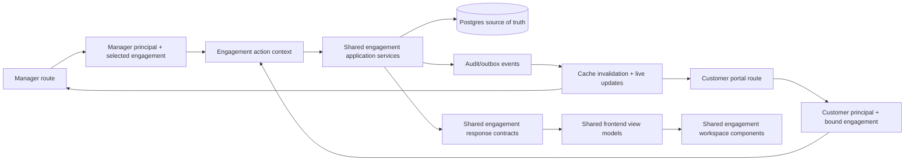

# Customer Portal Full-Action Engagement Mirror — Implementation Plan

> **Status:** In progress — shared shell, dashboard, findings, scanner, and engagement workspace implemented
> **Date:** 2026-09-08
> **Target:** Full manager-equivalent UI and actions for the customer's assigned engagement
> **Execution rule:** First replace the separate customer presentation with the exact manager shell and page components. Then activate those shared controls through engagement-scoped shared services. Each slice must be independently testable, observable, and reversible.
> **Backend architecture:** `docs/superpowers/specs/2026-09-08-customer-engagement-workspace-backend-architecture.md`

## Goal

The customer portal must be a mirror of the manager's engagement experience. A customer can see and perform the same engagement-specific actions, and those actions must immediately become the same source of truth the manager sees.

This is not a read-only reporting portal and not a reduced customer projection. It is a second authenticated entry point into the same engagement workspace.

> **One engagement workspace, one business-logic layer, one database truth, two authenticated entry points.**

## Implementation checkpoint — 2026-09-09

- Shared `PageShell`/`Sidebar` composition now owns both authenticated surfaces.
- Dashboard, Findings, Scanner, and Engagement pages render the same component trees through thin route wrappers.
- Customer authentication resolves the active database binding on every request.
- Finding mutations use one workflow service and write origin-aware lifecycle/audit events.
- Scan launch uses one command mapping, is forced to the assigned probe, remains queued while that probe is offline, and commits its audit record atomically with the job.
- Engagement details, scope, status, assets, activity, evidence import, and scan navigation are customer-actionable and operate on the manager's rows.
- Remaining page migrations: campaign/job detail, assigned-probe fleet controls, reports/review, AI Brain, detection/validation/attack paths, and engagement-scoped settings.

## Non-negotiable product rules

1. **Exact UI means component reuse, not visual imitation.** Customer and manager must render the same shell primitives, page layouts, tables, filters, drawers, tabs, forms, scanner controls, loading states, and responsive behavior. A separately copied portal component does not satisfy this requirement even if it currently looks similar.
2. **The customer experience is actionable.** Controls are not removed or converted into read-only labels merely because the actor entered through the customer portal.
3. **Every page is pinned to one engagement.** The engagement comes from the authenticated customer session. Every count, chart, finding, asset, job, report, agent, activity event, AI answer, filter option, and mutation is scoped to that engagement.
4. **Manager and customer mutate the same entity.** There is no copied portal record, approval shadow state, or later synchronization job. A successful action is visible from both entry points because both read the same database row and event history.
5. **Scanner is the manager scanner in engagement mode.** It uses the same scanner component, validation, enqueue logic, progress model, job detail, results, and cancellation. The engagement control is visibly pinned to the assigned engagement rather than offering another engagement.
6. **Route/auth differences must not create design differences.** `/portal/*` may remain a separate authenticated entry point, but route mapping and transport are configuration supplied to the same UI components.

## Product interpretation

### Full parity inside the assigned engagement

The customer can:

- View and edit engagement details, dates, status, scope, exclusions, description, tags, and other engagement-owned fields.
- View posture, exposure, SLA, trends, activity, attack surface, attack paths, findings, jobs, and campaign progress.
- Start scans directly using the assigned vedha-agent, monitor progress, and cancel queued/running jobs.
- Import authorized evidence and trigger re-detection.
- View full engagement finding detail and evidence.
- Change finding state, add notes, accept risk, mark remediation, reopen findings, and request/run validation.
- Generate remediation guidance and use engagement-grounded AI assistance.
- Generate, review, approve, reject/regenerate, print, and export reports.
- Run engagement-scoped detection, validation, prioritization, correlation, and explainability workflows exposed in the manager UI.
- Operate the vedha-agent assigned to the engagement where the manager UI supports an engagement-scoped action.

Every successful customer mutation writes to the same records and event history as a manager mutation. Manager and customer screens therefore converge on the same result without reconciliation or data copying.

### Boundaries that still exist

“No restriction” means no feature downgrade inside the assigned engagement. It cannot mean an unscoped manager credential. The following remain outside the mirror because they are tenant-global or cross-engagement concerns:

- Listing or opening other engagements.
- Viewing another engagement's findings, assets, reports, jobs, agents, activity, or AI context.
- Global customer/user provisioning and role administration.
- Tenant-wide fleet enumeration, agent enrollment secrets, bootstrap tokens, PATs, credentials, provider secrets, and integration secrets.
- Tenant-wide billing, licensing, runtime configuration, and system administration.

These are trust boundaries, not cosmetic UI restrictions. Everything that belongs to the assigned engagement remains available.

## Current architecture and why it must change

The existing portal was designed as a customer-safe, mostly read-only projection:

- `ClientFindingOut` intentionally removes manager finding fields.
- `/portal/reports` exposes only approved output.
- Scan execution is replaced by an approval-gated scan request.
- The portal BFF catch-all supports only GET and POST JSON requests.
- The portal shell and many pages are separate copies.
- Portal dashboard endpoints do not consistently match manager component contracts.

That architecture cannot provide true action parity. Adding individual portal mutations would duplicate manager business logic and inevitably produce different validation, audit, cache, and error behavior.

The correct change is to extract engagement operations into shared application services and have manager and customer transports call those same services through different authentication/scope resolution.

## Target architecture

The backend remains a modular monolith with a separate durable worker and remote probes.
The linked backend architecture specification defines the module interfaces, trust model,
transaction template, scan lifecycle, data-model changes, event flow, failure behavior,
and rollout constraints. This plan must not introduce a separate portal database, portal
business-logic service, or router-to-router delegation.

## Core engineering decisions

1. **Shared services, never route-to-route calls.** Manager and portal routers become thin transports over the same application services.
2. **Scope is resolved before business logic.** A manager may select an authorized engagement; a customer action context always injects the engagement from the signed session and rejects conflicting IDs.
3. **Same engagement DTOs.** If a field is part of the manager's engagement workspace and is not tenant-global/secret-bearing, both entry points receive the same contract.
4. **Same mutations and state machines.** Finding transitions, scan launch/cancel, report review, evidence import, validation, and engagement edits use one implementation.
5. **Same components.** Portal pages are thin route wrappers around the manager's engagement workspace, not visual copies.
6. **Actor origin is preserved.** Audit events record customer versus manager principal while updating the same entity history.
7. **Concurrency is explicit.** Simultaneous manager/customer edits cannot silently overwrite one another or duplicate long-running jobs.
8. **Safety guards are invariant, not approval gates.** Scope validation, confirmation for destructive actions, queue limits, idempotency, and audit apply equally to customer and manager.

## Full parity matrix

| Engagement capability | Manager | Customer mirror | Shared source of truth |
|---|---:|---:|---|
| Overview/posture/SLA/exposure | Yes | Yes | Analytics and posture services |
| Edit engagement metadata | Yes | Yes | Engagement update service |
| Edit included/excluded scope | Yes | Yes | Engagement scope service + audit |
| Import evidence/assets | Yes | Yes | Import/ingest service |
| Trigger re-detection | Yes | Yes | Detection run service |
| Launch scan directly | Yes | Yes | Scan enqueue service |
| View pipeline/job detail | Yes | Yes | Job/campaign query service |
| Cancel queued/running scan | Yes | Yes | Job cancellation service |
| Findings list/detail/evidence | Yes | Yes | Finding query service |
| Finding status/notes/risk acceptance | Yes | Yes | Finding transition service |
| Reopen/remediate/validate | Yes | Yes | Lifecycle/validation services |
| Remediation generation | Yes | Yes | Remediation service |
| Attack surface/paths/graph | Yes | Yes | Graph/exposure services |
| AI Brain/assistant | Yes | Yes | Engagement-grounded AI service |
| Report generate/review/export | Yes | Yes | AI report service |
| Detection/correlation workflows | Yes | Yes | Detection services |
| Assigned-agent status and jobs | Yes | Yes | Agent/job service scoped to assignment |
| Other engagements/global fleet/users/secrets | Yes, by role | No | Tenant administration, outside engagement mirror |

## Exact page/component mapping

| Manager source of truth | Customer entry point | Required customer behavior |
|---|---|---|
| Application shell (`PageShell`, sidebar, header, footer, theme) | Every `/portal/*` page | Render the same shared shell component and tokens; only identity text and route targets are configured |
| Manager dashboard panels | `/portal` | Same panel components and interaction states, with every query bound to the assigned engagement |
| Engagement detail workspace | `/portal/engagement` (or the portal overview workspace) | Same overview, edit, scope, evidence, activity, attack-surface, and re-detection controls |
| Findings list and focused detail drawer | `/portal/findings` | Same compact table/list, filters, priority, drawer, tabs, lifecycle actions, evidence, remediation, and history |
| Scanner | `/portal/scans` | Same scanner page and launch form; assigned engagement is selected and locked, assigned vedha-agent is used |
| Campaign/job detail | `/portal/scans/[job-or-campaign-id]` | Same stage pipeline, logs/status, results drill-down, retry where supported, and cancellation |
| Fleet/assigned probe detail | `/portal/fleet` | Same agent status and engagement-job controls for the probe assigned to the engagement |
| Reports | `/portal/reports` | Same generation, progress, draft, review, approval/rejection, print, and export UI for engagement reports |
| AI Brain | `/portal/assistant` | Same engagement-grounded AI experience and finding context |
| Detection/validation/attack paths | Portal engagement routes/tabs | Same manager components and actions, all inputs and results pinned to the engagement |

No portal page may query an unscoped collection and filter it in the browser. Engagement scoping must occur in the backend query/action context before records are returned.

## Critical failure modes to design out

| Priority | Failure scenario | Required prevention |
|---|---|---|
| P0 | Customer changes an ID in a URL/body to mutate another engagement | Server injects bound engagement; conflicting identifiers fail closed |
| P0 | Portal reimplements manager validation and the two paths drift | Both routers call the same service function and state machine |
| P0 | Customer launch creates duplicate scans after retry/double-click | Idempotency key, transactional enqueue, unique operation record |
| P0 | Manager and customer edit the same finding/scope concurrently | Version/ETag precondition or atomic transition with conflict response |
| P0 | Existing portal cookie is rejected by the frontend proxy | Route-aware cookie gate and portal-login exception |
| P0 | Portal BFF drops PATCH/PUT/DELETE or multipart evidence uploads | Method-complete, streaming-safe BFF contract |
| P0 | Shared UI navigates a portal user to manager-only URLs | Principal-aware route map used by every shared component |
| P0 | Contract mismatch renders a real critical count as zero | Runtime validation; malformed metrics show data-quality error |
| P1 | Customer scope edit changes the meaning of an already-running scan | Every job stores an immutable scope snapshot; changes affect future jobs |
| P1 | Manager screen stays stale after a customer mutation | Shared cache invalidation/outbox event and bounded live refresh |
| P1 | Customer can operate an agent assigned elsewhere | Agent operations join through the bound engagement assignment |
| P1 | Report/AI jobs race, duplicate, or expose another engagement's context | Scoped job ownership, idempotency, bounded context, status polling/live event |
| P1 | Evidence upload exhausts memory or carries malformed data | File-size/type limits, streaming parse, schema validation, bounded errors |
| P1 | Audit history loses who performed an action | Actor ID, actor type, origin, reason, before/after, correlation ID in one transaction |
| P2 | Full parity becomes two large copied frontends | Shared workspace components with thin route entry points |

## Task 0 — Freeze the parity contract

**Priority:** P0

- [ ] Inventory every engagement-specific manager read and mutation from Overview, Findings, Scan/Campaign, Reports, AI Brain, detection validation, attack paths, and assigned-agent jobs.
- [ ] Mark each operation as engagement-owned or tenant-global.
- [ ] Create an action matrix recording route, method, input schema, service owner, current role gate, audit event, cache invalidation, and expected portal route.
- [ ] Add failing contract tests for the known summary, trends, top-findings, route, and cookie mismatches.
- [ ] Capture baseline manager engagement and portal screenshots in light/dark desktop and mobile.
- [ ] Confirm the risk-score scale and lifecycle vocabulary once and reuse it everywhere.

**Done when:** Every manager engagement action has an explicit portal-parity disposition and no operation is migrated by guesswork.

## Task 1 — Replace the portal presentation with the exact manager UI

**Priority:** P0

**Files:**

- Add: `manager/frontend/components/shell/AppShell.tsx`
- Add: `manager/frontend/components/engagement-workspace/*`
- Modify: `manager/frontend/components/PageShell.tsx`
- Modify: `manager/frontend/components/Sidebar.tsx`
- Modify: `manager/frontend/components/portal/PortalShell.tsx`
- Modify: manager and portal page entry points to use the same page components
- Add: frontend tests that assert manager and portal wrappers mount the same component identities

- [ ] Extract one configurable `AppShell` from the manager shell; both manager and portal wrappers render it.
- [ ] Use one navigation-item renderer, active-state rule, responsive drawer, header, footer, refresh, theme, typography, spacing, and focus behavior.
- [ ] Replace portal overview, findings, scanner, job/campaign, fleet, reports, AI, and engagement/scope pages with thin wrappers around manager-owned shared page components.
- [ ] Remove portal-specific visual copies after each replacement is verified.
- [ ] Provide one route map to shared components so links remain in the current authenticated entry point.
- [ ] Pin the scanner engagement control to the authenticated engagement while preserving the manager scanner's exact control geometry and states.
- [ ] Keep all actions visible where the same manager engagement action is visible; until a mutation transport lands, gate rollout of that migrated page instead of shipping a deceptive disabled/read-only copy.
- [ ] Capture paired manager/customer screenshots at identical viewport, theme, engagement, and data state; compare shell, spacing, typography, controls, drawer behavior, and scanner layout.

**Done when:** For the same engagement and state, manager and customer render the same component tree and interaction layout. Differences are limited to actor identity, route prefix, and the visibly pinned engagement selector.

## Task 2 — Fix portal authentication and transport parity

**Priority:** P0

**Files:**

- Modify: `manager/frontend/proxy.ts`
- Modify: `manager/frontend/app/api/portal/[...path]/route.ts`
- Modify: `manager/frontend/lib/portal-client.ts`
- Add: `manager/frontend/tests/portal-auth-routing.test.ts`
- Add: `manager/frontend/tests/portal-bff-methods.test.ts`

- [ ] Make `/portal/login` public and gate other portal pages with `vedha_portal_token`.
- [ ] Keep operator and portal credentials distinct; simultaneous sessions must work.
- [ ] Support GET, POST, PATCH, PUT, and DELETE through the portal BFF.
- [ ] Forward query strings, content type, accepted response type, correlation ID, and idempotency key.
- [ ] Support bounded multipart uploads without converting files to JSON.
- [ ] Preserve backend status codes and stable error payloads.
- [ ] Refresh once on 401, replay only safe/idempotent requests, and otherwise return to the portal login.
- [ ] Never automatically replay a non-idempotent mutation without an idempotency key.

**Done when:** Any engagement operation supported by the shared service can be transported through either authenticated entry point without semantic differences.

## Task 3 — Introduce an engagement action context

**Priority:** P0 security foundation

**Proposed backend module:** `manager/backend/app/auth/engagement_access.py`

The context should contain:

- `tenant_id`
- `engagement_id`
- `actor_id`
- `actor_type` (`manager` or `customer`)
- granted engagement capabilities
- request/correlation ID

- [ ] Resolve manager context from the authenticated tenant plus requested engagement.
- [ ] Resolve customer context only from the signed session's bound engagement.
- [ ] Reject or ignore caller-supplied customer engagement IDs; use one documented rule consistently.
- [ ] Require every engagement service method to accept this context instead of loose tenant/engagement IDs.
- [ ] Authorize entity IDs by joining through the context engagement before read or mutation.
- [ ] Resolve assigned-agent operations through `Engagement.assigned_agent_id`.
- [ ] Preserve separate denial for tenant-global administration.
- [ ] Add cross-tenant, cross-engagement, forged-ID, stale-session, disabled-user, and unassigned-agent tests.

**Done when:** Business services physically cannot execute without an authorized engagement context.

## Task 4 — Extract shared application services

**Priority:** P0

**Proposed modules:**

- `manager/backend/app/services/engagement_workspace.py`
- `manager/backend/app/services/finding_workflow.py`
- `manager/backend/app/services/scan_operations.py`
- `manager/backend/app/services/report_workflow.py`
- Existing detection, validation, remediation, posture, graph, and event services reused where already deep enough

- [ ] Move engagement query/update logic out of routers.
- [ ] Move finding detail, filtering, transitions, notes, reopen, remediation, and event recording behind one service boundary.
- [ ] Move scan enqueue, job query, campaign progress, and cancel operations behind one service boundary.
- [ ] Move report generate/status/draft/approve/reject behind one service boundary.
- [ ] Make manager routes call the services first and prove no behavior regression.
- [ ] Add portal routes as second transports over the same services.
- [ ] Remove portal-to-operator handler imports after service extraction.
- [ ] Keep audit writes and state mutations in the same transaction.

**Done when:** There is exactly one implementation of every mirrored engagement action.

## Task 5 — Unify API contracts and frontend data adapters

**Priority:** P0

**Files:**

- Modify: `manager/frontend/lib/adapters.ts`
- Modify: `manager/frontend/lib/console-source.tsx`
- Modify: `manager/frontend/lib/portal-client.ts`
- Modify: `manager/backend/app/schemas/portal.py` or replace engagement projections with shared engagement workspace schemas
- Add: `manager/frontend/tests/engagement-contract-parity.test.ts`

- [ ] Define stable frontend view models for the complete engagement workspace.
- [ ] Normalize snake_case/camelCase, enums, dates, pagination, risk scores, evidence, job stages, and nullable fields once.
- [ ] Use the same response schema for manager and customer where the data is engagement-owned.
- [ ] Keep a separate redacted schema only for tenant-global secrets or credentials that are not part of the workspace.
- [ ] Add runtime validation for security metrics and mutations.
- [ ] Never coerce missing/invalid critical data to zero, clean, complete, or verified.
- [ ] Add first-class datasets for trends, assets, attack paths, jobs, detection results, and finding events.

**Done when:** Shared components cannot tell whether data arrived through manager or portal transport.

## Task 6 — Prove the shared UI is driven by engagement-scoped contracts

**Priority:** P1

**Proposed frontend structure:**

- `manager/frontend/components/shell/AppShell.tsx`
- `manager/frontend/components/engagement-workspace/EngagementWorkspace.tsx`
- `manager/frontend/components/engagement-workspace/Overview.tsx`
- `manager/frontend/components/engagement-workspace/Findings.tsx`
- `manager/frontend/components/engagement-workspace/AttackSurface.tsx`
- `manager/frontend/components/engagement-workspace/Scans.tsx`
- `manager/frontend/components/engagement-workspace/Reports.tsx`
- `manager/frontend/components/engagement-workspace/Detection.tsx`
- `manager/frontend/components/engagement-workspace/Activity.tsx`

- [ ] Keep manager `/engagements/[id]` and customer `/portal` as thin wrappers around the same workspace established in Task 1.
- [ ] Feed shared pages a normalized engagement workspace contract rather than mode-specific response shapes.
- [ ] Render the same action buttons whenever the action belongs to the engagement.
- [ ] Do not branch visual structure on `manager` versus `customer`.
- [ ] Use route maps and action transports as configuration; do not fork component markup.
- [ ] Preserve the existing Vedha palette, typography, severity language, borders, focus rings, and light/dark themes.
- [ ] Keep page density operational: compact tables and focused detail panels rather than oversized cards.

**Done when:** Changing an engagement component once changes both experiences.

## Task 7 — Implement action parity in safe vertical slices

**Priority:** P1

Each slice includes shared service, both transports, shared component, audit event, cache invalidation, and tests before moving to the next.

### Slice A — Engagement overview and editing

- [ ] Same status control, edit form, dates, brief, tags, scope, and exclusions.
- [ ] Same metrics, posture, SLA, patch comparison, exposure, assets, and activity.
- [ ] Scope changes require an explicit confirmation and authorization statement, not manager approval.
- [ ] Persist an immutable before/after scope audit event.
- [ ] Running jobs retain their launch-time scope snapshot.

### Slice B — Findings and remediation

- [ ] Same compact list, filters, sorting, pagination, and focused detail panel.
- [ ] Same Overview, Evidence, Remediation, and History tabs.
- [ ] Same notes, accepted-risk, status, remediation, reopen, validation, and priority actions.
- [ ] Same risk score and backend explanation.
- [ ] Every transition uses atomic lifecycle rules and appends an event.

### Slice C — Scans, campaigns, and evidence import

- [ ] Replace portal scan request/approval with direct launch through the shared enqueue service.
- [ ] Same use cases, target selection, intensity, assigned-agent behavior, queue limits, progress, results, and cancel action.
- [ ] Add idempotency to launch, cancel, and import operations.
- [ ] Validate target scope at request time and dispatch time.
- [ ] Stream/limit file uploads and reject malformed or oversized evidence safely.

### Slice D — Reports and AI

- [ ] Same report source selection, generation, progress, draft, approve, reject/regenerate, print, and export.
- [ ] Same AI Brain and finding explanation/remediation workflows scoped to the engagement.
- [ ] Bound prompt/context size and treat evidence as untrusted data, never instructions.
- [ ] Record model job status and audit customer review actions.

### Slice E — Detection, correlation, attack surface, and assigned agent

- [ ] Same asset/service inventory, attack graph, paths, chokepoints, blast radius, prioritizer, and detection explanation.
- [ ] Same engagement-scoped validation/detection runs and result views.
- [ ] Same assigned-agent status and engagement job controls.
- [ ] Never enumerate other agents or expose enrollment/bootstrap secrets.

**Done when:** The parity matrix is fully checked and each action produces the same state transition from both entry points.

## Task 8 — Make manager/customer state converge immediately

**Priority:** P1

- [ ] Emit a shared domain/outbox event after every successful engagement mutation.
- [ ] Include engagement ID, entity type, entity ID, action, revision, actor type, and timestamp without sensitive payloads.
- [ ] Reuse the existing event/websocket infrastructure if it satisfies authenticated engagement subscriptions; otherwise add a scoped stream.
- [ ] Invalidate matching React Query keys in both UI modes when an event arrives.
- [ ] Keep bounded polling as a recovery path after disconnect.
- [ ] Show “updated by customer/manager” and freshness where it helps resolve simultaneous work.
- [ ] Deduplicate events and tolerate reconnect/replay.

**Acceptance:** A customer action appears in an already-open manager view within the agreed live-update window without manual refresh, and vice versa.

## Task 9 — Concurrency, idempotency, and transactional integrity

**Priority:** P1

- [ ] Add an entity revision/ETag strategy for engagement and finding edits.
- [ ] Return 409/412 with current server state when a stale edit is submitted.
- [ ] Use atomic/locked transitions for finding lifecycle and scan cancellation.
- [ ] Require idempotency keys for scan launch, evidence import, re-detection, report generation, and other expensive retryable mutations.
- [ ] Store operation outcomes so safe retries return the original result.
- [ ] Prevent duplicate report jobs and scan jobs under double-click/network retry.
- [ ] Keep mutation, audit event, and outbox event in one database transaction.
- [ ] Test manager/customer races, duplicate requests, cancellation/result races, and scope-edit/scan-launch races.

**Done when:** Concurrent entry points cannot silently lose updates or create duplicated work.

## Task 10 — UI/UX quality and failure states

**Priority:** P2

- [ ] Use the manager engagement hierarchy as the visual source of truth.
- [ ] Keep the engagement identity and live state persistent in the header.
- [ ] Prioritize current risk, active work, and required action before historical detail.
- [ ] Use severity colors only for severity; use blue for actions, teal for verified health, and purple for AI/machine output.
- [ ] Give every panel independent loading, empty, stale, error, retry, success, and unauthorized states.
- [ ] Display optimistic feedback only when rollback behavior is defined; otherwise confirm on server response.
- [ ] Preserve list scroll while resetting the selected detail panel to its top.
- [ ] Confirm high-impact actions with precise consequences, not generic “Are you sure?” dialogs.
- [ ] Support 1440px, 1024px, 768px, and 390px widths in light and dark themes.
- [ ] Verify keyboard navigation, focus trapping, focus restoration, labels, live regions, contrast, and reduced motion.

**Done when:** Portal and manager are visually indistinguishable at the engagement-workspace level except for identity and route context.

## Task 11 — Performance, observability, and operational safety

**Priority:** P2

- [ ] Paginate findings, assets, events, jobs, and report history.
- [ ] Replace full-table in-memory summaries with bounded database aggregates.
- [ ] Prevent N+1 asset/service, agent/job, and finding/event queries.
- [ ] Measure query plans before adding indexes.
- [ ] Add structured logs with request ID, tenant ID, engagement ID, actor ID/type, action, latency, result, and stable error code.
- [ ] Add metrics for mutation failures, authorization denials, conflicts, idempotency replays, queue saturation, live-update lag, and contract validation failures.
- [ ] Do not log raw evidence, credentials, prompts, report content, or secret-bearing job parameters.
- [ ] Define recovery behavior for database, Redis, agent, websocket, and AI dependency failures.

**Done when:** Every customer mutation is diagnosable, bounded, recoverable, and attributable.

## Task 12 — Verification and rollout

### Automated validation

- [ ] Frontend typecheck: `cd manager/frontend && npx tsc --noEmit`
- [ ] Frontend lint: `cd manager/frontend && npm run lint`
- [ ] Frontend tests: `cd manager/frontend && node --import tsx --test tests/*.test.ts`
- [ ] Frontend production build: `cd manager/frontend && npm run build`
- [ ] Focused backend tests for auth, engagement scope, findings, scans, cancellation, reports, validation, AI, event history, and customer access.
- [ ] Full backend test suite after focused tests pass.
- [ ] Run the Impeccable UI detector once after implementation is complete.

### Mandatory parity tests

- [ ] For each action, manager and customer produce the same entity state and response view model.
- [ ] Customer actions become visible in an already-open manager session and vice versa.
- [ ] Portal navigation never leaves `/portal` for an engagement workflow.
- [ ] Customer cannot override its engagement ID through path, query, JSON, multipart fields, websocket subscription, or job identifier.
- [ ] Assigned-agent actions cannot address an agent attached to another engagement.
- [ ] Direct scans remain inside current authorized scope and immutable job scope snapshots.
- [ ] Simultaneous edits return a conflict rather than silently overwriting.
- [ ] Duplicate mutations return one operation result rather than creating duplicate work.
- [ ] Audit timelines identify customer versus manager actions.

### Browser acceptance matrix

- [ ] Portal login, direct deep link, refresh, session refresh, logout, and simultaneous manager/portal sessions.
- [ ] Light/dark desktop, tablet, and mobile.
- [ ] Empty, typical, and large engagements.
- [ ] No/offline/busy assigned agent.
- [ ] Queued/running/completed/failed/cancelled scan.
- [ ] Finding edit, accepted risk, remediation, reopen, and validation.
- [ ] Scope edit followed by scan launch.
- [ ] Evidence import success, partial parse failure, oversized input, and retry.
- [ ] Report generation/review/regeneration failure and recovery.
- [ ] Live-update disconnect and polling recovery.

### Rollout sequence

1. Extract and mount the exact manager shell/page components in the portal, beginning with shell, dashboard, findings, and scanner; do not release a migrated page with fake disabled actions.
2. Land route-aware portal auth, method-complete BFF transport, and failing engagement-scope tests needed to activate those controls safely.
3. Extract the shared action context and services while manager behavior remains unchanged.
4. Add portal transports and normalized engagement contracts.
5. Activate actions in vertical slices A–E, starting with scanner and finding lifecycle parity.
6. Enable live state convergence and concurrency controls.
7. Complete responsive/accessibility/performance QA with paired manager/customer screenshots.
8. Remove obsolete read-only portal code, scan-request approval flow, copied components, and conflicting documentation only after parity tests pass.

Each phase should be a separate reversible commit. Do not remove the working manager path until the shared replacement is verified.

## Documentation that must be corrected during implementation

The following currently describe the old read-only/approval-gated model and must be updated after the new behavior is implemented:

- `manager/frontend/PORTAL_UX_PLAYBOOK.md`
- `docs/superpowers/specs/2026-08-13-customer-portal-design.md`
- `docs/superpowers/specs/2026-08-16-user-portal-reskin-scan-request-design.md`
- `manager/frontend/UI_PAGE_MAP.md`

Historical decisions should not be silently rewritten. Mark the earlier model as superseded and link to this plan/new design decision.

## Definition of done

The customer portal is complete when:

- It renders the same engagement workspace components and visual system as the manager.
- Every engagement-specific manager action is available through the portal and calls the same backend service logic.
- Customer and manager actions update the same records, lifecycle history, reports, jobs, evidence, and analytics.
- An already-open screen on either side receives the other side's changes without manual reload.
- Direct scan launch, cancellation, evidence import, finding transitions, report review, AI, validation, and detection flows all work for the bound engagement.
- The customer cannot access another engagement or tenant-global secrets even through crafted API requests.
- Concurrency conflicts and retries do not lose updates or duplicate expensive work.
- All contract, parity, authorization, race, idempotency, accessibility, responsive, build, and full regression checks pass.
