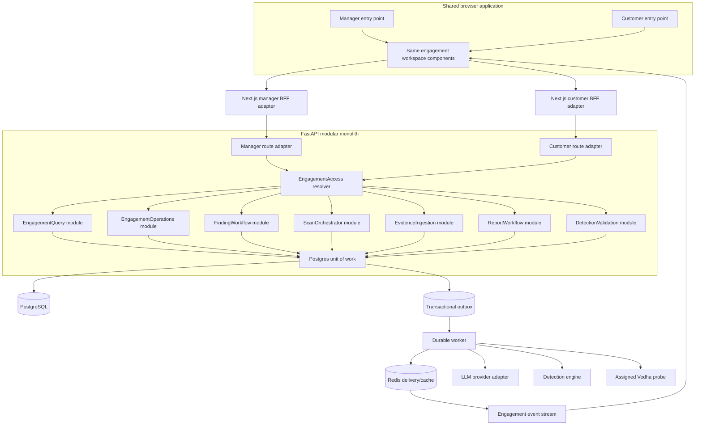
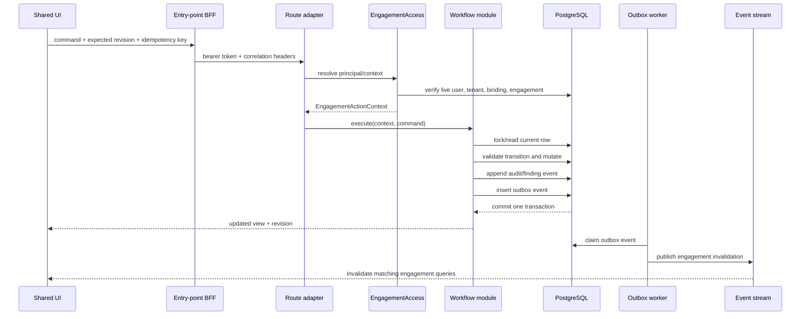

# Customer Engagement Workspace — Backend Architecture

> **Status:** Proposed after repository inspection
> **Date:** 2026-09-08
> **Scope:** Manager/customer parity for one engagement, including reads, mutations, scanner execution, findings, reports, AI, detection/validation, audit, and live convergence
> **Related implementation plan:** `docs/superpowers/plans/2026-09-06-customer-portal-engagement-parity.md`
> **Related detection decision:** `docs/adr/0002-detection-architecture.md`

## Executive decision

Keep Vedha as a **modular monolith with a separate durable worker and remote probes**.
Do not split this work into microservices. The manager and customer experiences operate on
the same engagement records and require transactional consistency; introducing network
boundaries between findings, scans, reports, and audit would add failure modes without a
measured scaling requirement.

The change should introduce a clean seam inside FastAPI:

> **Two authenticated route adapters → one engagement action context → shared deep modules → one PostgreSQL source of truth.**

Manager and customer routes may differ in authentication and URL shape. They must not own
different business rules, queries, transitions, or response contracts.

## Current system, verified from the repository

### Existing topology worth retaining

- Next.js is the browser-facing BFF and keeps access tokens in separate HttpOnly manager
  and customer cookies.
- FastAPI is the control plane and applies JWT audience separation plus tenant isolation.
- PostgreSQL is the source of truth for engagements, findings, jobs, evidence, reports,
  audit history, and the transactional outbox.
- Redis is an acceleration/delivery substrate for cache and cross-worker probe push; it is
  not the source of truth.
- The outbox worker provides durable at-least-once background processing.
- Probes are thin, outbound-only collectors. The manager owns policy, detection,
  correlation, prioritization, and reporting.
- Scan result attempts already use leases, fences, and checksums, which is the correct base
  for safe retry/cancellation.

### Architectural gaps blocking true parity

| Priority | Current evidence | System risk | Target correction |
|---|---|---|---|
| P0 | `routers/portal.py` implements separate projections and imports operator route functions for some analytics | Portal and manager behavior/contracts drift; routers become coupled implementations | Both route groups call shared application modules; never call one router from another |
| P0 | Core rules remain inside large `engagements.py`, `findings.py`, `agents.py`, and `ai_report.py` handlers | A second transport must copy rules or bypass role gates | Move commands/queries behind small, explicit module interfaces |
| P0 | Customer engagement is carried in the JWT and accepted by `portal_scope.py` | Disable/rebind changes are not guaranteed to affect an already-issued access token immediately | Resolve the live user/tenant/engagement binding when building every customer action context |
| P0 | `users.client_engagement_id` and `engagements.assigned_agent_id` use single-column foreign keys | The database cannot prove that the user, engagement, and assigned probe belong to the same tenant | Add same-tenant composite foreign-key invariants and keep query-level checks |
| P0 | `ScanJob.agent_id` represents the active claimant, while pending pinning is also attempted through job fields/JSON | A job can target the wrong probe or become unclaimable; assignment intent and execution ownership are conflated | Separate `target_agent_id` from `claimed_agent_id` and enforce assignment during atomic claim |
| P0 | `ScanJob.result` initially carries request parameters and is later replaced by output | Authorization input, immutable launch scope, and result state can be overwritten or misinterpreted | Separate request, immutable scope snapshot, progress summary, and result references |
| P0 | Direct scan enqueue commits before WebSocket delivery; other long work uses FastAPI `BackgroundTasks` | Crash windows and non-durable AI/re-detection execution | Commit command state + outbox event atomically; dispatch/generation/re-detection run through durable workers |
| P0 | Portal response schemas intentionally omit manager finding/report fields | Exact page/action parity is impossible and missing values can look clean | Use shared engagement workspace contracts; redact only tenant-global secrets |
| P1 | Human UI updates use local React Query invalidation/polling; current WebSockets serve probes/graphs | An action in one open browser is stale in the other | Publish engagement-change invalidation events after commit; retain polling recovery |
| P1 | Some reads may use a replica | An invalidation event can arrive before the replica contains the new revision | Guarantee read-your-write on the primary and make revision-aware refetch explicit |
| P1 | Portal summary/trend/list paths load complete finding sets | Large engagements consume excess memory and latency grows with history | Use SQL aggregates and cursor/page-bounded queries |
| P1 | Refresh reconstructs tokens without the full login account-state checks | Disabled customer/tenant sessions can continue through refresh | Revalidate user, tenant, binding, session generation, and refresh-token rotation |
| P1 | Recoverable customer passwords are stored for later reveal | A database/key compromise can expose usable passwords | Move to one-time reveal/reset; retain only password hashes after migration |

## Target runtime architecture



## Trust and scope model

### Principal context versus engagement action context

Authentication produces a `Principal`:

```text
Principal
  actor_id
  actor_type       manager | customer | system
  tenant_id
  role
  auth_type
  session_version
```

Before any workspace module runs, `EngagementAccess.resolve(...)` produces the only
context accepted by engagement modules:

```text
EngagementActionContext
  tenant_id
  engagement_id
  actor_id
  actor_type
  origin           manager-ui | customer-ui | api | worker
  capabilities
  correlation_id
```

The interface is intentionally small:

```python
resolve_manager(principal, requested_engagement_id) -> EngagementActionContext
resolve_customer(principal) -> EngagementActionContext
```

- The manager adapter supplies the requested engagement and the resolver verifies tenant
  ownership and role capability.
- The customer adapter never accepts engagement identity from path, query, JSON, or
  multipart form. It loads the current user binding and engagement from the primary
  database and produces the context.
- Every entity lookup joins through both `tenant_id` and `engagement_id` from this context.
- Customer and manager receive the same engagement capability set for actions included in
  the shared workspace. Tenant-global administration is a different module and never
  receives an `EngagementActionContext`.

### Required invariants

1. Every customer request resolves exactly one active engagement.
2. The engagement belongs to the principal's tenant.
3. The assigned probe belongs to the same tenant and is the probe selected for a pinned
   engagement scan.
4. A resource ID is insufficient authorization; it must resolve through the context's
   engagement.
5. The request body cannot broaden the context.
6. The same command validation and state machine execute for manager and customer.
7. Security controls such as authorized scope, OT passive-only policy, queue ceilings,
   validation gates, and confirmation requirements apply to both actors.

## Deep modules and their interfaces

These are modules, not new network services. SQLAlchemy, Redis, LLM, and probe delivery
adapters remain implementation details behind their interfaces.

### 1. EngagementAccess

**Owns:** live account state, tenant/engagement relationship, capabilities, actor origin,
and resource-scope checks.

**Does not own:** UI routing, finding transitions, scan logic, or database serialization.

**Test surface:** valid manager/customer resolution; disabled user/tenant; changed binding;
forged engagement/resource IDs; cross-tenant assignment.

### 2. EngagementQuery

**Owns:** normalized engagement detail, dashboard metrics, assets, activity, SLA, posture,
exposure, trends, jobs, report history, and filter facets.

**Interface shape:** a small set of workspace-shaped queries rather than one method per
widget. Aggregates execute in SQL and lists are bounded.

```python
get_workspace(context) -> EngagementWorkspaceView
list_findings(context, filters, page) -> Page[FindingListItem]
get_finding(context, finding_id) -> FindingDetailView
get_scan(context, job_id) -> ScanDetailView
```

### 3. EngagementOperations

**Owns:** engagement status, dates, description/tags, scope, exclusions, rules of
engagement, and lifecycle validation.

Scope edits create an immutable audit entry, increment a revision, and affect only future
jobs. Existing jobs keep the launch-time scope snapshot.

### 4. FindingWorkflow

**Owns:** finding lifecycle state machine, notes, risk acceptance, remediation state,
reopen, validation request/result, risk recalculation, finding events, audit, and change
publication.

The transition interface accepts an expected revision and returns either the new view or a
typed conflict. Routers must not assign finding fields directly.

### 5. ScanOrchestrator

**Owns:** use-case resolution, target validation, scope/RoE policy, queue limits,
idempotent launch, assigned-probe selection, job state machine, progress, cancellation,
and dispatch events.

```python
plan(context, request) -> ScanPlan
launch(context, request, idempotency_key) -> ScanJobView
cancel(context, job_id, expected_revision) -> ScanJobView
```

The plan and launch paths use the same policy function; launch revalidates because scope,
probe state, or RoE may have changed after the UI preview.

### 6. EvidenceIngestion

**Owns:** streaming limits, content-type/schema validation, malwareing table, provenance,
deduplication, immutable storage, and durable detection trigger.

Raw evidence is treated as untrusted data. A parse failure is explicit and never rendered
as zero findings or a clean scan.

### 7. ReportWorkflow

**Owns:** idempotent generation, durable job status, bounded engagement context, draft
sections, review transitions, regeneration, export readiness, and audit.

LLM execution is a worker adapter. FastAPI returns an accepted operation and never owns a
non-durable in-process generation task.

### 8. DetectionValidation

**Owns:** durable detection replay, active validation requests, result interpretation,
correlation, attack-path recomputation, and health states. Its implementation must follow
ADR-0002: evidence and evaluation are separate, detection identity is stable, and degraded
coverage can never prove remediation.

### 9. WorkspaceEvents

**Owns:** one typed event envelope for cache invalidation and user-visible freshness.

```text
event_id
tenant_id
engagement_id
aggregate_type
aggregate_id
action
revision
actor_type
occurred_at
correlation_id
```

Payloads contain identifiers and state hints only—never evidence blobs, report text,
credentials, prompts, tokens, or scan secrets.

## Command transaction

Every mutation follows one transaction template:



No router commits midway through a module. No WebSocket/Redis/LLM/probe call occurs inside
the database transaction. Side effects happen after the durable outbox event exists.

## Scan lifecycle and data ownership

### Job state machine

```text
queued -> claimed -> running -> completed
                         |  -> failed
        \--------------------> cancelled
claimed/running --lease expiry--> queued (retry budget remains) | failed
```

Terminal states are immutable except through an explicitly defined retry command that
creates a new logical job linked to the prior job.

### Recommended scan-job fields

| Field | Purpose |
|---|---|
| `engagement_id` | Ownership and query scope |
| `requested_by`, `requested_by_type`, `origin` | Actor provenance |
| `target_agent_id` | Probe the engagement action intended to use |
| `claimed_agent_id` | Probe holding the current fenced attempt |
| `request_payload` | Validated use case, targets, intensity, and non-secret options |
| `scope_snapshot` | Immutable included/excluded scope and RoE policy version at launch |
| `status`, `revision` | State machine and optimistic concurrency |
| `progress_summary` | Bounded stage/progress/error information for UI reads |
| `result_ref` | Reference to append-only evidence/results, not the raw facts blob |
| `idempotency_key` | Duplicate launch protection |

The current `agent_id` and `result` columns should remain readable during migration, then
be retired only after old jobs and probe versions are compatible.

### Direct customer scan flow

1. Customer opens the shared manager scanner component.
2. The backend supplies the session-bound engagement and its assigned probe.
3. `plan` validates target subset, exclusions, use case, capability, reachability, OT/IoT
   policy, queue budget, and estimated bounds.
4. `launch` repeats authoritative validation and stores the immutable scope snapshot.
5. Job + audit + outbox dispatch event commit atomically.
6. Dispatcher offers the job only to `target_agent_id`; HTTP polling remains the fallback.
7. The probe atomically claims an attempt and receives the fence/snapshot.
8. Results are accepted only from the current claimed agent, attempt, fence, and checksum.
9. Evidence persists before durable detection/correlation is triggered.

The obsolete customer scan-request approval path stops receiving new requests once direct
launch parity is enabled. Historical request rows remain readable for audit until retention
policy permits archival.

## Data model changes

### P0 integrity

- Add same-tenant composite foreign keys for customer-to-engagement and
  engagement-to-assigned-probe relationships.
- Add `revision` to mutable engagement, finding, report-review, and scan-job aggregates.
- Split scan assignment/request/scope/progress/result ownership as described above.
- Add uniqueness for one active execution of an idempotency key.
- Add stable actor type/origin/correlation fields to the audit trail.

### Idempotency record

For expensive commands use a dedicated table keyed by:

```text
(tenant_id, engagement_id, actor_id, operation, idempotency_key)
```

It stores a request hash, operation/resource ID, terminal response summary, and expiry.
Reusing a key with the same hash returns the original result; reusing it with a different
hash returns a conflict.

### Session validity

Add a monotonically increasing `session_version` (or equivalent security stamp) to users.
Access/refresh credentials carry it. Password reset, disable, tenant disable, or engagement
rebind increments it. The customer context resolver verifies live account state and the
version before an action runs.

### Audit/event relationship

- `audit_logs` answer **who requested what and from where**.
- `finding_events` answer **how one finding's lifecycle changed**.
- `outbox_events` answer **which post-commit side effect must run**.
- Workspace invalidation events answer **which open views must refresh**.

They are related but not interchangeable. All relevant rows are created in the same
transaction as the state change.

## Read consistency and manager/customer convergence

### Same source of truth

No synchronization table or copy job is needed. Both sides read the same normalized
workspace views from PostgreSQL. “Reflect both ways” is therefore a consistency and cache
invalidation problem, not data replication.

### Read-your-write

- A command returns the updated primary-database view and revision.
- The initiating UI updates that query cache from the response.
- For a short bounded period after a mutation, revision-sensitive detail reads use the
  primary rather than a potentially lagging read replica.

### Other open sessions

- The transaction inserts `engagement.changed` into the outbox.
- A worker publishes a compact invalidation event through Redis.
- Authenticated manager and customer event endpoints subscribe only to authorized
  engagement rooms.
- The browser invalidates normalized React Query keys and refetches.
- Bounded polling remains recovery when streaming or Redis is unavailable.

The proposed product SLO is **visible in another already-open session within two seconds
under healthy conditions**, with the database authoritative immediately. This SLO requires
product confirmation before it becomes an acceptance gate.

## Security architecture

### Keep audience separation

Manager and customer JWT audiences remain distinct. A portal token is accepted only by
portal/auth adapters, even though both adapters call the same modules. Shared business logic
does not mean shared credentials.

### Authorization occurs twice

1. Route adapter: correct token audience and entry point.
2. EngagementAccess/module: actor capability plus resource ownership in the active
   engagement context.

The second check is mandatory because route configuration is not an authorization model.

### Input and output rules

- Validate path/query/body/form identifiers against the resolved engagement context.
- Use allowlisted Pydantic command schemas; reject unknown security-sensitive fields.
- Limit upload bytes, decompressed bytes, row counts, target expansion, query page size,
  AI context, and execution time.
- Keep credentials out of scan-job JSON, audit detail, logs, events, AI context, and UI
  responses.
- Treat evidence/report/LLM text as untrusted content and never execute it as instructions.
- Preserve OT passive-only and engagement scope enforcement in manager, customer, and probe.

## Failure behavior

| Failure | Expected behavior |
|---|---|
| Stale edit | `409` or `412` with current revision and server view; never silent overwrite |
| Duplicate launch/generation | Original operation returned for same idempotency hash |
| Same key, different request | `409` conflict |
| Assigned probe offline | Job remains durably queued with explicit reason/retry state; no silent reroute unless policy explicitly permits it |
| Queue full | `409` with current depth and recovery action |
| Out-of-scope target | `422`; no job/audit success event created, but security rejection is logged safely |
| Worker unavailable | Command state remains committed; operation shows queued/degraded and queue-age alert fires |
| Redis/event stream unavailable | Direct responses still work; clients recover by bounded polling |
| Read replica behind | Revision-aware read falls back to primary |
| LLM unavailable | Report/AI operation fails explicitly; deterministic security data remains available |
| Partial evidence parse | Store accepted/quarantined counts, mark degraded, and never interpret missing evidence as clean |

## Observability and SLOs

Every command log/trace should include:

- correlation ID, actor ID/type/origin, tenant ID, engagement ID
- module/operation, aggregate ID, prior/new revision
- idempotency replay/conflict outcome
- latency and stable result/error code

Required metrics:

- customer/manager command success, failure, denial, and conflict rates
- p50/p95/p99 command/query latency by module
- outbox oldest-event age, queue depth, retry, and dead-letter count
- scan queue wait, claim, run, cancellation, retry, and result-rejection rates
- UI event publication lag and fallback-poll recovery
- cross-engagement/tenant denial counts
- detection ingest quarantine, degraded runs, evaluation lag, and auto-resolution safety gates

Initial SLO proposals to confirm:

- ordinary engagement reads p95 < 500 ms
- ordinary mutations p95 < 800 ms, excluding asynchronous work
- cross-session visibility < 2 seconds under healthy conditions
- zero accepted cross-tenant or cross-engagement access
- zero duplicate expensive operations for a repeated idempotency key

## Deployment shape

Keep the existing deployables:

```text
frontend (Next.js BFF)
api      (FastAPI modular monolith, horizontally scalable)
worker   (outbox consumers, horizontally scalable)
postgres (authoritative state)
redis    (cache, pub/sub, probe push; non-authoritative)
neo4j    (optional attack-path projection)
probe    (remote customer-network collector)
```

Do not add Kafka, a service mesh, a separate portal backend, or a second portal database
for this feature. Revisit a service split only after module-level metrics show an isolated
scaling or failure-containment requirement—most likely detection/AI workers, not the
engagement transaction path.

## Implementation order

1. **Exact shared UI first:** extract the manager shell/pages and mount them in the portal
   with a pinned engagement route/data adapter. Do not ship controls until their shared
   command path is active.
2. **P0 auth/data invariants:** route-aware portal cookie gate, live client binding checks,
   refresh hardening, and same-tenant database constraints.
3. **Shared access/query modules:** normalize workspace contracts and replace router-to-router
   calls and separate portal projections.
4. **FindingWorkflow:** lifecycle, evidence, remediation, validation, risk, audit, revision,
   and event parity.
5. **ScanOrchestrator:** split job fields, assigned-probe enforcement, direct launch,
   cancellation, idempotency, durable dispatch, and scanner/campaign parity.
6. **Engagement/evidence operations:** metadata, scope/RoE, imports, re-detection trigger,
   revisions, and immutable scope snapshots.
7. **Report/AI/detection modules:** durable worker jobs and identical review/actions.
8. **Live convergence:** engagement invalidation stream, revision-aware reads, polling fallback.
9. **Retire old portal behavior:** stop new scan requests, remove portal-only business logic and
   copied contracts after migration telemetry and parity tests pass.

Each phase is a reversible commit with manager regression tests, customer parity tests,
cross-tenant negative tests, and migration rollback notes.

## Architecture acceptance tests

- The same command fixture through manager and customer adapters produces the same aggregate
  state and normalized response, differing only in actor provenance.
- Every customer route/action returns data only from the session-bound engagement.
- Forged path, query, JSON, multipart, WebSocket/SSE room, finding, job, report, asset, and
  agent identifiers fail closed.
- Database constraints reject cross-tenant user/engagement and engagement/agent bindings.
- Customer and manager finding transitions append to the same lifecycle history.
- Customer and manager scan launches enter the same state machine and only the assigned
  probe can claim them.
- Double-click, timeout retry, and BFF replay create one expensive operation.
- A stale manager/customer edit cannot overwrite a newer edit from the other side.
- Open manager and customer sessions converge after a mutation; stream failure recovers by
  polling.
- Worker restart does not lose scan dispatch, detection replay, report generation, or UI
  invalidation events.
- Invalid/partial scan evidence cannot produce a clean/verified posture state.

## Decisions intentionally deferred

- Supporting one customer login across multiple engagements. The current requirement says
  one specific engagement per customer session, so this architecture preserves that model.
- Splitting detection or AI into independent services. Metrics—not preference—should trigger
  that change.
- A specific cross-session visibility SLO. Two seconds is proposed, not assumed.
